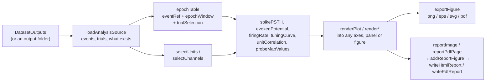

# Analysis: quick-look figures

The [`analysis`](../analysis) folder turns the pipeline's outputs into
figures: PSTHs with rasters, evoked potentials, firing rates, tuning curves,
heatmaps, probe maps, unit-by-unit correlation matrices, auROC curves and
behavioral values per trial (response latency by depth, say).
Every figure can be aligned to **any digital line**
(onset or offset; the first, last, every or nth interval per trial), and
trials can be **filtered and grouped by Epsych2 parameters** (Depth,
TrialType, response bits). Figures are exported as PNG / EPS / SVG / PDF and
collected into a self-contained HTML report and / or a multi-page PDF.
Per-unit response tests and a population analysis over every unit of every
dataset give numbers as well as figures.

It is for quick looks. Spectra, coherence and other analyses belong in
[Chronux](ChronuxDataset.md) or [FieldTrip](FieldTripExport.md).

`analysis` depends on `pipeline`: it reads the outputs through
[`DatasetOutputs`](DatasetOutputs.md). `pipeline` needs `analysis` only for
its Analysis step, which runs an analysis config over the pipeline's
selected datasets ([EphysPipeline → Analysis step](EphysPipeline.md#analysis-step);
the pipeline app's **Analysis** tab), and for the links that open
[`EphysAnalysisApp`](EphysAnalysisApp.md): the pipeline app's **File → Open
analysis app...**, the Project tab's **Tools** panel (**Analysis app**) and
the Analysis tab's **Open in the analysis app**. Without `analysis` on the
path, everything else in the pipeline still runs.
`addpath_nogit('C:\src\ephys_analysis')` puts both on the path.

<!-- wiki: More on `DatasetOutputs` in [Loading outputs](Loading-Outputs). -->

Everything the app does can be done from a script, at three levels, each
usable without the next:

| Level | What you write | Use it to |
| --- | --- | --- |
| [Config + runner](#runner) | load or build an [`EphysAnalysisConfig`](EphysAnalysisConfig.md), run it with `EphysAnalysisRunner` | draw a saved set of figures over many datasets, e.g. after every pipeline run |
| [Generated scripts](#generated-scripts) | `EphysAnalysisScript.compact` / `.standalone` | reproduce an app session exactly, or see every call a run makes |
| [The functions](#a-worked-script) | `loadAnalysisSource`, `epochTable`, `spikePSTH`, `renderPlot`, ... | your own alignment, your own figure layout, or numbers instead of figures |

The app, [`EphysAnalysisApp`](EphysAnalysisApp.md), is a GUI over the runner.

## A worked script

The runner is a thin sequence of public functions. Call them yourself to
align differently, draw into your own figures, or keep the numbers.



`loadAnalysisSource`, `selectUnits` and `selectChannels` read the files; the
compute functions are pure (no file reading, no graphics); the renderers
draw into a target you give them and never create figures.

<!-- wiki: Their full signatures are on [Analysis functions](API-Analysis-Functions). -->

```matlab
addpath_nogit('C:\src\ephys_analysis')               % pipeline + analysis
out = DatasetOutputs("D:\EPHYS\SYNTH-01\SYNTH-01_260918_101500", CacheData=true);
src = loadAnalysisSource(out);                        % events, trials, what exists
src.lines                                             % the digital lines: Line, Count, MeanDurationSec, ...
src.paramNames                                        % the Epsych2 parameters to filter and group by

% epochs: the first Stim onset of every paired trial, grouped by Depth
ref = eventRef(line="Stim", edge="onset", which="first", scope="trial");
win = epochWindow(pre=-0.2, post=0.8);
sel = trialSelection(filter="Hit | Miss", groupBy="Depth");
[E, G] = epochTable(src, ref, Window=win, Selection=sel);

% sorted units -> PSTH + raster
[st, meta] = selectUnits(src, struct('source', "units", 'classes', "su"));
R = spikePSTH(st, E, Window=[-0.2 0.8], BinSec=0.01, SmoothSec=0.01, Groups=G, Meta=meta);
R.epochs = E;

fig = newExportFigure(struct('FigureSizeCm', [18 12]));
renderPlot(R, struct('kind', "psth", 'layout', "grid"), fig);
exportFigure(fig, "D:\out\psth_stim", Format=["png" "svg"], Dpi=150);
close(fig)

% LFP evoked potential, stacked by depth, baseline subtracted
[Y, fs, cm] = selectChannels(src, "LFP");
V = evokedPotential(Y, fs, E, Window=[-0.1 0.5], Baseline=[-0.1 0], Groups=G, Meta=cm);
figure; renderEvoked(V, gcf, Layout="stack");
```

The other kinds take the same epochs and units:

```matlab
% firing rate per epoch, baseline subtracted; a tuning curve over Depth
F = firingRate(st, E, Baseline=[-0.2 0], Normalize="subtract", Groups=G, Meta=meta);
figure; renderRates(F, gcf, Layout="points");
[Et, Gt] = epochTable(src, ref, Window=win, Columns="Depth");   % Depth on every epoch
Ft = firingRate(st, Et, Groups=Gt, Meta=meta);
T = tuningCurve(Ft.rate, Et.Depth, Param="Depth", Meta=meta, Units=Ft.units);
figure; renderTuning(T, gcf, Layout="overlay");

% unit-by-unit correlation of the peak binned rate, Spearman
C = unitCorrelation(st, E, Metric="peak", BinSec=0.01, SmoothSec=0.01, Type="spearman", Groups=G, Meta=meta);
C.r(:, :, 1)                                          % [nUnits x nUnits] of the first group
figure; renderCorrMap(C, gcf, Style=struct('HeatColormap', "turbo", 'CLim', [-0.5 0.5]));

% a value per probe site
U = unitSummary(src, Source="units");                 % label, class, channel, shank, x, y, nSpikes, rateHz
P = probeMapValues(U, src.probe, Value="rate");
figure; renderProbeMap(P, [], gcf);

% any kind in one call, with the title the runner gives it
renderPlot(R, struct('kind', "psth", 'layout', "overlay", 'histStyle', "line"), figure);
```

## The source

`src = loadAnalysisSource(out)` takes a
[`DatasetOutputs`](DatasetOutputs.md) (or a folder, which becomes
`DatasetOutputs(folder, CacheData=true)`) and reads the small things every
analysis needs. **No signal and no spike time is loaded**: `selectUnits` and
`selectChannels` load those through `src.outputs` when a plot needs them.

| Field | Meaning |
| --- | --- |
| `name`, `key`, `folder`, `outputs` | the dataset, its key (`Key=` option), output folder and `DatasetOutputs` |
| `fs`, `durationSec` | recording rate and length: the manifest's `metadata.fs` / `duration_s`, else the extract (`info.origFs`, `info.<SIG>.nSamples / Fs`), else the pairing. Rates divide by `durationSec`, never by the time of the last spike. `fs` is also the rate the digital-event rows count at (`t = row/fs`), which `epochTable` uses |
| `events` | line → `[k x 2]` `[t_on t_off]` s, **polarity applied**, from the extract (the smallest extract file's `events`) |
| `artifacts` | `[k x 2]` `[tStart tEnd)` s on the continuous clock (row r at `(r − 1)/fs`): the artifact periods the Signals step erased (that file's `info.artifacts.intervals`; `zeros(0,2)` when none). `epochTable` drops the epochs that touch one, for spike plots too. Only these periods count: with `Signals.BlankArtifacts` off (or `Artifacts.ApplyToSignals` off while sorting or detection used the automatic periods) the periods erased before sorting or detection are not here |
| `invertedLines`, `lines` | lines inverted; table `Line, Count, MeanDurationSec, First, Last, Inverted` |
| `labels` | amplifier channel labels (`info.labels`) |
| `signals`, `signalFs` | `LFP / MUA / SPIKE / AUX` → extract present, and its rate |
| `hasBehavior`, `hasTrials` | a behavior file was found; it carries the trial pairing (`TrialOnset`, `TrialEvents`, ...) |
| `trials`, `nTrials`, `pairing` | `behavior.trials` (text columns as `string`), `behavior.pairing` |
| `paramNames` | every trial column but the pairing's times and samples (`TrialOnset`, `TrialOffset`, `TrialOnsetSample...`, `TrialEvents`, `TrialEventSamples`), `RespCode` included, in alphabetical order (ignoring case) |
| `respField` | `"RespCode"`, `"ResponseCode"` or `""` |
| `trialLine`, `subject`, `startTime` | from the pairing and the session |
| `probe`, `probeFile`, `probeSource` | the manifest's `probe.file`, decoded (`chanMap` 0-based, `xc`, `yc` µm, `kcoords`). Without one (a dataset sorted with the pipeline's default probe, which the manifest records only with `Probe.WriteDefaultToManifest`), the map the sort used: its `channel_map.npy`, `channel_positions.npy` and `channel_shanks.npy`, in the same fields. `probeSource` says which: `"manifest"`, `"sorting"` or `""` (none) |
| `hasUnits` | the sorting folder holds sorted units (read once through `DatasetOutputs.load("sorting")`) |
| `hasDetected`, `spikesFile` | the spikes file holds threshold detections |

## Event reference, window, selection

Three small structs describe an alignment. Each constructor fills what you
leave out from [`EphysAnalysisConfig.defaults`](EphysAnalysisConfig.md#building-blocks),
coerces the rest and checks it: `eventRef(Name=Value)` or `eventRef(s, Name=Value)`.

### `eventRef`: what each epoch is aligned to

| Field | Default | Meaning |
| --- | --- | --- |
| `line` | `"Stim"` | digital line; `"Trial"` is the paired trial line |
| `edge` | `"onset"` | `"onset"` or `"offset"` of each interval |
| `which` | `"first"` | `"first"`, `"last"`, `"all"`, `"nth"` (per trial in trial scope, over the recording otherwise) |
| `n` | 1 | the interval `"nth"` takes |
| `scope` | `"auto"` | `"trial"`: the line's intervals whose edge lies inside each selected trial, `[TrialOnset, TrialOffset]` (an interval spanning several trials counts once, for the trial holding its edge); `"recording"`: every interval (`src.events`); `"auto"`: trial when the dataset has paired trials |
| `minDurationSec`, `maxDurationSec` | 0, `Inf` | keep intervals whose length is in range |
| `timeRange` | `[-Inf Inf]` | keep events in range: from the trial onset (trial scope) or the recording start |
| `offsetSec` | 0 | added to every event time |
| `offsetParam` | `""` | a numeric trial parameter, e.g. `"RespLatency"`: each event is moved by its trial's value of it, so epochs can be aligned to a per-trial time such as the response (`line "RespWindow"`, `offsetParam "RespLatency"`). Needs paired trials; an event outside the trials, or whose trial has no finite value (a miss), is dropped |
| `offsetParamUnit` | `"ms"` | `offsetParam`'s unit: `"ms"` (as Epsych2 stores times) or `"s"` |
| `sequence` | none | steps that must (or must not) follow each event: a struct array of `relation` (`"followedBy"` / `"notFollowedBy"`), `line`, `edge`, `n`, `maxGapSec`, `minDurationSec`, `maxDurationSec` ([event sequences](EphysAnalysisConfig.md#event-sequences)) |
| `alignStep` | `Inf` | the sequence's event each epoch is aligned to: `0` the line's own, `k` step `k`, `Inf` the last followedBy step |

An event can be a sequence of events. The first Trough onset after the end
of each CR trial:

```matlab
ref = eventRef(line="Trial", edge="offset", sequence=struct('line', "Trough"));
E = epochTable(src, ref, Selection=trialSelection(response="CR"));
```

Each step looks for its event after the event before it (never past the
next trial's onset), within its `maxGapSec`; an event whose sequence does not
complete is left out before `which` picks, and counted
(`nDroppedNoSequence`). The trial stays the one holding the line's own
event, so the CR selection applies to the trial that ended. Steps whose
fields differ go in a cell: `sequence={struct('line', "Trough"),
struct('line', "Trough", 'edge', "offset")}`. `eventRefLabel(ref)` names
it: `"Trial offset then Trough onset"`.

`resolveEvents(src, ref, mask)` returns the event times `t`, the trial row of
each (`NaN` outside trials) and its rank. An interval belongs to the trial
whose `[TrialOnset, TrialOffset]` holds its `edge`, in both scopes: once, and
an edge on the boundary of two touching trials belongs to the earlier trial.
In trial scope `"Trial"` (or the trial line itself) is the trial's own
`[TrialOnset TrialOffset]`, and a line whose intervals lie between trials
(`Platform` on the synthetic fixture) has no event: use recording scope for
it. In recording scope each event is assigned the trial that holds its edge;
with a restrictive selection (below) events outside the kept trials are
dropped. With `offsetParam` each event is then moved by its trial's value
(`[t, trial, k, shift, nNoValue] = resolveEvents(...)`: `shift` the
seconds added, `nNoValue` the events dropped for lacking a value), and the
events are sorted after the shift; the trial is still the one holding the
unshifted edge. With a `sequence`, `t` is each event's `alignStep` event,
`trial` and `k` those of the line's own event, and a sixth output
`nNoSequence` counts the events it cost. Errors: `resolveEvents:NoTrials` (also `offsetParam`
without paired trials), `resolveEvents:NoLine`, `resolveEvents:NoParam` /
`resolveEvents:BadParam` (`offsetParam` is not a numeric trial column),
`resolveEvents:NoEvents`.

### `epochWindow`: the span of each epoch

| Field | Default | Meaning |
| --- | --- | --- |
| `mode` | `"fixed"` | `"fixed"`: `[t0+pre, t0+post]`; `"between"`: `[t0+pre, t1+post]` where `t1` is the stop event |
| `pre`, `post` | -0.2, 0.8 | seconds |
| `stop` | `[]` | an `eventRef` ending each epoch. Required for `"between"`. In `"fixed"` mode it still fills `t1`, so renderers mark it and `spikePSTH` can mask after it |

The stop event of an epoch is the first (`stop.which`) stop event at or
after `t0`, in the same trial when the epoch has one: it is looked up among
the intervals overlapping that trial, so it may fall after the trial ends. Use
`"between"` for a variable-length period, e.g. `RespWindow` onset →
`RespWindow` offset. A stop with its own `offsetParam` is moved by the
epoch's trial's value of it (no stop when that trial has none): with
`stop=eventRef(line="RespWindow", offsetParam="RespLatency")` each
stimulus-aligned epoch's `t1` is its response. A stop with a `sequence` is
the first of its line's events at or after `t0` whose sequence follows,
e.g. `stop=eventRef(line="RespWindow", edge="offset", sequence=struct('line', "Trough"))`
stops at the first Trough onset after the response window.

### `trialSelection`: which trials, in which groups

| Field | Default | Meaning |
| --- | --- | --- |
| `filter` | `""` | an expression over `behavior.trials`, e.g. `Depth > 0 & RespLatency < 500` or `Hit \| Miss` |
| `response` | none | keep trials that are **any** of these response words |
| `pairingFlags` | `"ok"` | keep trials with this `PairingFlag` (`[]` keeps every flag) |
| `trials` | `[]` | explicit rows of `behavior.trials` |
| `groupBy` | none | 0-2 parameters; one group per value (pair of values) |
| `groupOrder` | `"ascending"` | `"ascending"`, `"descending"` or `"appearance"` |
| `maxGroups` | 12 | more groups is `selectTrials:TooManyGroups` |

Response words are the bits of `RespCode` ([`respCodeBits`](../analysis/respCodeBits.m)):
Hit 1, Miss 2, CR 4, FA 8, Reward 32, Punish 64, NoResponse 128, Response 256.

**Filters** are compiled from an allow-list and never passed to `eval`:
column names become `T.("name")`; response words `bitand(RespCode, bit) > 0`
(a column of the same name wins); `!` is `~`, `!=` is `~=`, a single `=` is
`==`, `&&` / `||` are the row-wise `&` / `|`; the functions `abs round floor
ceil fix mod rem min max isnan isfinite ismissing ismember any all strcmp
strcmpi contains startsWith endsWith lower upper string double bitand` and
`true false pi NaN Inf` are allowed; field access, `;`, `@` and every other
name are rejected (`trialSelection:BadFilter`). Text columns compare with
`==`. A parameter whose name is not a valid MATLAB identifier can only be
grouped by, not filtered on.

`[mask, G, gi] = selectTrials(src, sel)` applies it: `mask` over
`src.trials`, the groups table `G` (`index, label, color, n, <params>`, labels
like `"Depth = 0.5"`), and each trial's group. Colours: a numeric parameter
with more than two values runs through parula; otherwise `lines`; one
ungrouped set is dark grey. Without paired trials there is one group
`"all"`, and a filter / response / trials / groupBy raises
`selectTrials:NoTrials`.

### `epochTable`

`[E, G] = epochTable(src, ref, Window=win, Selection=sel, Incomplete="drop", Artifacts="drop", Baseline=[], Columns=[])`
gives one row per epoch, by time: `epoch, trial, t0, t0Continuous, t1,
tStart, tStop, duration, complete, artifact, groupIndex, group` and the `groupBy` (and
`Columns`) parameters of each epoch's trial. `t0` is the digital-event time
(`t = row/fs`); `t0Continuous` is the same event on the continuous clock of the
signals and spike times, `(row-1)/fs` = `t0 - 1/fs` (plus `offsetSec`),
computed from the row so that it equals the time of a spike in that sample.
`tStart` / `tStop` are on the clock of `t0`. `complete` means the window lies inside the
recording and, in `"between"` mode, has its stop event; incomplete epochs are
dropped unless `Incomplete="keep"`. `artifact` means the window, shifted to
the continuous clock (by `t0Continuous - t0`), touches one of `src.artifacts`
(half-open periods: `EphysDataset.overlapsIntervals`); those epochs are
dropped, for signal and spike plots alike, unless `Artifacts="keep"`,
which keeps them flagged (so with the default the column is always false).
`Baseline=[b0 b1]` (s from `t0`) widens that test to a baseline window that
reaches outside `[tStart, tStop]`; the runner passes each plot's baseline.
`G.n` is the number of epochs per group,
`G.nTrials` the kept trials. With `ref.offsetParam`, `t0` and
`t0Continuous` both carry the shift (`t0Continuous` is still the event's
sample on the continuous clock, `t0 - 1/fs`). `E.Properties.UserData`
records `ref`, `window`, `selection`, `scope`, `nEvents`,
`nDroppedNoValue` (events `offsetParam` dropped; not in `nEvents`),
`nDroppedNoSequence` (events the `sequence` cost; not in `nEvents`),
`nDroppedNoStop`, `nDroppedEdge`, `nDroppedArtifact`, `nTrials`,
`nTrialsSelected` and `dataset`. Nothing usable is `epochTable:NoEpochs`; an
unknown `src.fs` is `epochTable:NoRate`.

To see how a reference, window and selection cut a dataset,
`d = EpochDiagram(); d.update(src, ref, win, sel, Baseline=b)` draws it:
the digital lines as TTL traces with each event, window and epoch, the
epochs dropped and why, and the epochs aligned to their event. `d.Epochs` is
the `epochTable` with every event kept, plus `kept`, `number` and `reason`.
It is the app's [epoch diagram](EphysAnalysisApp.md#epoch-diagram).

### Units and channels

`[st, meta] = selectUnits(src, usel)` loads spike trains: `st` is
`{nUnits x 1}` spike times (s) and `meta` a table `label, unitId, class,
channel, channelName, shank, x, y, nSpikes`. `usel.source` is `"units"`
(sorted units, filtered by `classes`, `groups`, `ids`) or `"detected"`
(threshold detections, one "unit" per channel, class `"det"`, sites from the
probe map); both filter by `channels`, `shanks` and `maxUnits`. Shanks are
the probe map's `kcoords` values for both: a sorted unit on a mapped channel
takes its channel's shank, since the sorter's own shank numbers
(`channel_shanks.npy`) need not match them. Everything downstream
treats the two alike. `usel.quality` keeps the sorted units that meet
good-unit criteria, and `usel.response` the units that respond to the event
([response statistics](#response-statistics)). The response test needs the
events: `selectUnits(src, usel, Ref=ref, Selection=sel)` (the runner passes
the plot's own; `unitSummary` takes the same two options).
`usel.response.test` is `"evoked"` (responsive), `"tuning"` (tuned across
the levels of `param`), `"either"`, `"both"` or `"auroc"`: the units the
auROC calls modulated ([auROC](#auroc)). That test runs `aurocCurves` over
the test's epochs as one group, against `response.baseline`, with
`response.window` as the modulation window, auROC windows over
`[min(b0, w0) max(b1, w1)]`, its own bins (`response.auroc.binSec`) and
`response.auroc`'s `method`, `windows`, `windowSec`, `stepSec`, `cutoff`
(not `"none"`), `threshold`, `test` and `nResamples`; `correction` and
`alpha` are the response test's. `direction`
`"excited"` / `"suppressed"` (the evoked and auROC tests) keeps only the
units responding, or called, up / down. `meta` gains the test's columns:
`baselineRate, responseRate, pEvoked, qEvoked, direction, responsive`
(and, with `param`, the tuning test's), or for `"auroc"` `aurocMean,
aurocPhasic, aurocP, aurocQ, aurocDirection, aurocModulated`. `maxUnits`
applies after the test.

`[Y, fs, meta] = selectChannels(src, "LFP", Channels=...)` loads one derived
signal (`LFP`, `MUA`, `SPIKE` or `AUX`) through the outputs' cache: `Y` is
`[nSamples x nChannels]` single µV (AUX volts). `meta` has `label, channel`
(extract column), `recordingChannel` (`keepAmpChannels(channelRemap(c))`),
`shank, x, y, units`. With every channel in order, `Y` is the cached signal
itself, not a copy, and `evokedPotential` reads only the epochs' rows from it.
A MUA at 2 kHz × 64 channels × 1 h is about 1.8 GB, so
load one signal at a time and `clearCache()` between datasets (the runner
does).

## Time base

- Continuous signals: row `k` is at `t = (k-1)/Fs`, at every rate; spike
  times are seconds on the same clock.
- Digital events: `t = row/Fs` of the recording, one sample later for the same
  row. An event at row `r` happened at `(r-1)/Fs`, which is `E.t0Continuous`.
- `evokedPotential` uses rows `round(t0Continuous*fs) + 1 + (s0:s1)`, with
  `s0 = round(pre*fs)`, `s1 = round(post*fs)` and `R.t = (s0:s1)'/fs`: offset 0
  is the event's own sample at the recording rate, the nearest sample at a
  derived rate, as in `ChronuxDataset.trials` (`OnsetRule="event"`) and the
  pairing's `TrialOnsetSample_<SIG>`.
- Spikes are taken relative to `t0Continuous` (a spike in the event's own
  sample is at 0), and the windows of `firingRate` and `unitCorrelation` are
  moved to the spikes' clock by `t0Continuous - t0`.
- An event shifted by a trial parameter (`offsetParam`) carries the shift
  on both clocks, `t0 = row/Fs + offsetSec + shift` and `t0Continuous =
  (row-1)/Fs + offsetSec + shift`, so it need not fall on a sample. A
  raster's event marks (`epochEvents`) are digital-event times taken from
  `t0`, so they sit where the spikes of their sample sit.

## Compute

Pure functions, but for `unitSummary`, which loads the units through
`selectUnits`: no I/O, no graphics. Every result `R` carries `kind`,
`params`, `groups`, `labels`, `n`, `units` (the measurement unit) and
`created`; the runner adds `epochs`, `dataset` and `spec`.

| Function | Result |
| --- | --- |
| `spikePSTH(st, E, Window=, BinSec=, SmoothSec=, Measure=, Baseline=, BaselineMode=, MaskAfterStop=, Raster=, Groups=, Meta=, Auroc=)` | `t, edges, window, rate / sem / count [nBins x nUnits x nGroups], nEpochs, raster, epochGroup, epochStop, stopMean, baselineRate, baselineSD`. Defaults: `Window` `[-0.2 0.5]`, `BinSec` 0.01, `SmoothSec` 0 (a plot's default is 0.01), `Raster` true (`R.raster` keeps every spike's time relative to its event). Spikes are taken relative to each epoch's `t0Continuous`. Bins are whole multiples of `BinSec` from the event, `[k, k+1)·BinSec`, so the event is always an edge and no bin mixes spikes from before and after it; they are half-open (a spike exactly at a bin's end is in the next one). The window shrinks to the whole bins inside it, `R.window` (`[-0.25 0.5]` in 0.1 s bins is `[-0.2 0.5]`); one that holds no whole bin is `spikePSTH:BadWindow`. `Measure` is `"rate"` (default, spikes/s), `"count"` (spikes per bin per epoch) or `"probability"` (the share of epochs with a spike in the bin; its baseline uses whole `BinSec` bins from `b0`). Smoothing (Gaussian SD) applies to each epoch before averaging, renormalized at the edges. Baseline modes `none`, `subtract`, `zscore`, `percent` (per group, from spikes counted in the baseline window), or `auroc`: the curves become `aurocCurves`' auROC windows, `sem` NaN and `units` `"auROC"`, unsmoothed (`Auroc` holds its settings; `R.auroc` the calls; see [auROC](#auroc)). Named `spikePSTH` so it does not shadow Chronux's `psth` |
| `evokedPotential(Y, fs, E, Window=, Channels=, Baseline=, Detrend=, Incomplete=, KeepEpochs=, Groups=, Meta=, Units=)` | `t, mean / sem [nTime x nChan x nGroups], nEpochs, data (KeepEpochs), channels, labels, fs, units, sampleOffsets, onsetRule "event", keptEpochs, droppedEdge, droppedNonFinite`. Epoch *e* is rows `round(E.t0Continuous(e)*fs) + 1 + (s0:s1)`: onset rule `"event"`, offset 0 the sample nearest the one that produced the event (at the recording rate, that very sample). Only the epochs' rows of the used channels are read from `Y` |
| `firingRate(st, E, Measure=, Baseline=[b0 b1], Normalize=)` | `rate / count [nEpochs x nUnits]` over each epoch's `[tStart, tStop)`, moved to the spikes' clock by `t0Continuous - t0`, `duration`, `baseline` (`[b0 b1]` s around the event), `meanRate / sem / median [nUnits x nGroups]`, `baselineRate`. `Measure`: `rate` (default), `count` (spikes per window) or `probability` (1 for an epoch with a spike in its window; a group's mean is the share of such epochs). `Normalize`: `none`, `subtract` (per epoch), `ratio`, `zscore` (the unit's baseline over all epochs) |
| `tuningCurve(rates, x, Series=, Param=, SeriesParam=)` | `x` (sorted values), `series`, `mean / sem [nX x nUnits x nSeries]`, `n [nX x nSeries]`. Epochs without a value are left out; when none has one (recording-scope events that all fall outside the trials, say) it is `tuningCurve:NoValues` |
| `unitSummary(src, Source=, Units=, Ref=, Selection=)` | table `label, class, channel, shank, x, y, nSpikes, rateHz` with `rateHz = nSpikes / src.durationSec` |
| `probeMapValues(T, probe, Value=)` | one value per probe site: `rate` (summed Hz), `nSpikes`, `nUnits` |
| `epochEvents(src, E, Lines=, Edge=, Scope=, Sequences=)` | a raster's event marks: a struct per line and edge (`Edge` `"onset"`, `"offset"` or `"both"`), with `line`, `edge`, `label` (`"Trough onset"`), and for every event of that line inside each epoch's window (`Scope="window"`, the default) or inside the epoch's own trial too (`Scope="trial"`) its epoch (`epoch`, a row of `E`) and its time from the epoch's event (`t`, s, on the clock of `E.t0`). Every event is kept, so a trial with several beam crossings has several. `Sequences=` (event references with [sequences](EphysAnalysisConfig.md#event-sequences)) adds a struct per sequence after the lines, labelled by `eventRefLabel` (`"Trial offset then Trough onset"`): its events (`resolveEvents` over every trial, at each one's `alignStep`) in each epoch's window, and with `Scope="trial"` only those whose sequence started in the epoch's trial; one that never completes is an empty mark. `computePlot` adds it to a raster's result as `R.rasterEvents` |
| `behaviorValues(y, x, Series=, Param=, SeriesParam=, YName=, YUnits=)` | a per-epoch value `y` (a trial parameter, or a stop latency) gathered by the values of `x` and of an optional series: `x`, `xIsNumeric`, `series`, `groups` (one row per series), `mean / sem / median / n [nX x nSeries]`, `values` (table `epoch, xIndex, seriesIndex, y`: every value kept), `nEpochs`, `nMissing` (epochs whose `y`, `x` or series is missing, left out), `yName`, `units`. `behaviorValues:NoValues` when none is left, `behaviorValues:NotNumeric` for a text `y` |
| `unitCorrelation(st, E, Metric=, Type=, BinSec=, SmoothSec=, Baseline=, BaselineMode=, Groups=, Meta=)` | `r / p [nUnits x nUnits x nGroups]`, `meanR` (mean over the pairs), `nEpochs`, `response [nEpochs x nUnits]`. Each epoch's response is its `"mean"` rate over `[tStart, tStop)` (moved to the spikes' clock by `t0Continuous - t0`) or its `"peak"` binned rate (bins from `tStart`; a bin that runs past `tStop` is not used), optionally minus the epoch's baseline rate (`BaselineMode="subtract"`); every pair of units is then correlated over the epochs of each group, `Type="pearson"` or `"spearman"` (ties averaged). Fixed and `"between"` windows. An epoch whose response is not finite (a window shorter than one bin) is left out; a unit whose responses do not vary has NaN correlations, and so does every pair of a group with fewer than 3 epochs. Needs no toolbox; `p` is two-sided from the t distribution |

## Response statistics

`[T, info] = responseStats(st, E, Baseline=[b0 b1], Window=[w0 w1], Param=,
Correction=, Alpha=, Meta=)` tests every unit over the epochs of `E`. The
tests are the Statistics and Machine Learning Toolbox's own; the repository
adds only the counting and the p-value adjustment.

- **Counts.** Spikes per epoch in the baseline window `[t0+b0, t0+b1)` and
  the response window `[t0+w0, t0+w1)`, counted by `firingRate` on the
  spikes' clock (from `t0Continuous`).
- **Evoked.** `signrank(response, baseline)`: the Wilcoxon signed-rank test
  of the paired rates, two-sided, with `signrank`'s default method.
  `direction` comes from the two one-sided tests (`tail` `"right"` /
  `"left"`): `"excited"`, `"suppressed"`, or `"none"` when the two agree to
  1e-12 (equal rank sums).
- **Tuning** (with `Param`). `kruskalwallis(response, E.(Param), "off")`
  across the parameter's levels. Epochs without a level are left out. A
  unit with fewer than two levels is not tested. `bestLevel` is the level
  with the highest mean response rate (on a tie, the first in sorted
  order), and `bestRate` is that mean.
- **Counts or rates.** When the two windows are equally long, the tests
  run on the counts. Rates are the counts over one constant, so the result
  is the same, but the paired differences have no rounding error.
  Otherwise the tests run on the rates.
- **Correction.** Each test's p values are adjusted over the units tested
  with `pAdjust(p, Correction)`: `"bh"` (Benjamini-Hochberg, default),
  `"holm"`, `"bonferroni"` or `"none"`. Its results are R's `p.adjust`
  (NaN is not a test). The Statistics and Machine Learning Toolbox has no
  such function, so this is the one piece written here, and it is checked
  against statsmodels. A unit is `responsive` / `tuned` when its adjusted p
  is at most `Alpha` (default 0.05).
- **Epochs used.** Only epochs whose window `[tStart, tStop]` holds both
  test windows, since that is where `epochTable` checked the recording's
  ends and the artifact periods. The others are left out with
  `responseStats:EpochsLeftOut`: epochs flagged incomplete or artifact, and
  epochs too short for the windows. `selectUnits` builds its own epochs for
  the test: one fixed window `[min(b0,w0), max(b1,w1)]`.

`T` has one row per unit: `unit, label, nEpochs, baselineRate, responseRate,
pEvoked, qEvoked, direction, responsive` and, with `Param`, `nLevels,
pTuning, qTuning, tuned, bestLevel, bestRate`. A unit that is not tested has
NaN p and q and direction `""`. `info` records the windows, `param`,
`correction`, `alpha`, `tests`, `nEpochs`, `nEpochsLeftOut`, `nTestedEvoked`,
`nTestedTuning`, `counts`, the levels with the mean response rate and the
epochs per level and unit (`levels`, `levelRate`, `levelN`), and the toolbox
version. Without the toolbox it is `responseStats:NoToolbox`.
`Tests=false` skips the tests, so no toolbox is needed: the rates, the
per-level rates and `bestLevel` come out, with every p NaN.
`responseEpochs(src, ref, sel, Baseline=, Window=, Param=)` makes the epochs
of a test: the `epochTable` above.

## auROC

`A = aurocCurves(st, E, Window=, Baseline=, BinSec=, Measure=, Method=,
Windows=, WindowSec=, StepSec=, MaskAfterStop=, ModulationWindow=, Cutoff=,
Threshold=, Test=, NResamples=, Correction=, Alpha=, Call=, Seed=, Groups=)`
measures, per unit and group, how far the firing in each window around the
event stands apart from the firing in the baseline: the area under the ROC
curve (auROC; Cohen et al. 2012, Nature 482:85), as Macedo-Lima, Hamlette &
Caras (2024, Curr Biol 34:3354) use it. 0.5 is no difference, above 0.5
more firing than in the baseline, below less.

- **The values compared.** Spikes are counted in `BinSec` bins from the
  event (as `spikePSTH`; a spike on a bin edge, to within 1e-9 s, is in the
  bin that starts there, so a spike and an event on the same sample grid
  do not leave the bin to rounding). `Method="psth"` (default) compares the
  trial-averaged PSTH's bins inside a window with those inside the
  baseline, as the Caras lab's `calculate_auROC.py` does for the paper
  (10 ms bins, 100 ms windows). `Method="epochs"` compares each epoch's
  spike count in the window with the epochs' counts in window-long pieces
  of the baseline. `"rate"` and `"count"` give the same auROC;
  `"probability"` compares spike / no spike.
- **The auROC.** P(window value > baseline value) + P(equal) / 2 over all
  pairs: the area under the ROC curve that a criterion swept from 0 to the
  largest value draws. It is computed exactly from ranks (`tiedrank`). The
  lab's 0.1 Hz criterion sweep gives the same values (`test_Auroc` checks
  it against a port of that code, whose bin edges are rounded) with two
  exceptions. `calculate_auROC.py` builds its window edges from float
  sums, so some windows hold 11 bins (for its `[-2 5]` s setup the windows
  starting at 2.0, 2.3, 2.4, 2.7, 2.8, 3.1, 3.2, 3.5 and 3.6 s) and its
  last window 9, where `aurocCurves` always uses `WindowSec / BinSec`
  bins. And a unit with no spike at all in the span counted (`Window` and
  `Baseline`) over a group's epochs has no auROC: NaN in both (its curve,
  mean and phasic modulation here), so it is not called and stays out of
  the 95% CI cutoff.
- **Windows.** `Windows="tiled"` (default): back to back, `WindowSec` long
  (default 0.1), edged at whole multiples from the event; `"sliding"`: one
  every `StepSec`. Each is a whole number of bins
  (`aurocCurves:BadOption` otherwise); only windows wholly inside `Window`
  are used, and a window's time is its centre.
- **The call.** The windows wholly inside `ModulationWindow` give each
  unit's mean auROC and phasic modulation (mean |auROC - 0.5|) per group.
  `Cutoff="ci"` (default, the paper's): modulated up when the mean auROC is
  above 0.5 + c, down when below 0.5 - c, where c is the upper bound of the
  95% confidence interval of the mean phasic modulation over every unit
  and group with an auROC (`tinv`; the paper pooled every unit's curve for
  each trial type: hits and false alarms, n = 1050). It depends on the
  units passed in and needs many; with few it can exceed 0.5 and call none
  (`aurocCall:WideCutoff`), and with fewer than two unit x group phasic
  modulations there is none (`aurocCall:NoCutoff`).
  `"fixed"`: c = `Threshold`. `"test"`: a p per unit and group, adjusted
  over all of them (`pAdjust`), modulated at most `Alpha`, up or down by
  the mean auROC; `Test="bootstrap"` (the epochs resampled with
  replacement `NResamples` times; p = 2 x the share of resampled means on
  the far side of 0.5, +1 smoothed, at most 1), `"ranksum"` (the call
  window's values against the baseline's; values from the same epochs are
  not independent, so p runs small) or `"shuffle"` (each epoch's bins
  shifted circularly over the span counted, `NResamples` times; p = the
  share, +1 smoothed, whose phasic modulation reaches the observed).
  `"none"`: no call. The draws come from their own stream (`Seed`,
  default 0), so a result can be reproduced.
- **Calling over a larger pool.** The call is made by
  `A = aurocCall(A, Cutoff=, Threshold=, Correction=, Alpha=)`, over every
  unit and group of `A`: any struct with `mean`, `phasic` and `p`
  `[nUnits x nGroups]`. `aurocCurves(..., Call=false)` measures (and, with
  `Cutoff="test"`, tests) the units without calling them, so the units of
  several calls (several datasets) can be stacked and called in one
  `aurocCall`: one cutoff over every unit x group row, as the paper took it
  over its 533 units' trial-type curves, or one correction of the test's
  p values over all of them. `populationAnalysis` does this over its
  family. Called per session instead, the paper's calls are not
  reproduced; the cutoff pooled over every row is.

The defaults are `Window` `[-0.5 1]`, `Baseline` `[-0.5 0]` (cut to its
whole bins; it may lie outside `Window`), `BinSec` 0.01, `WindowSec` 0.1,
`StepSec` 0.01, `ModulationWindow` `[0 0.5]`, `Cutoff` `"ci"`, `Threshold`
0.1, `Test` `"bootstrap"`, `NResamples` 1000, `Correction` `"bh"` and
`Alpha` 0.05.

`A` holds `t` (window centres), `starts`, `stops`, `edges`, `window`,
`auroc` and `count` `[nWindows x nUnits x nGroups]`, `inModulation`, and per
unit and group `mean`, `phasic`, `p`, `q`, `direction` (`"increase"`,
`"decrease"`, `"none"`; `""` without a call or an auROC) and `modulated`,
plus `cutoff`, `cutoffValue` (c; NaN for `"test"` and `"none"`),
`nModulated` / `nIncrease` / `nDecrease` per group, `nUnits`, `baseline`
(its whole bins), `modulationWindow`, `method`, `windows`, `groups`, the
options (`params`) and the toolbox version.

`spikePSTH(..., BaselineMode="auroc", Auroc=)` draws on it for the psth and
heatmap plots, with a plot's [`auroc`](EphysAnalysisConfig.md#auroc)
settings (`aurocCurves`' options as `method`, `windowSec`, `cutoff`, ...;
`marks` draws the calls, `modulatedOnly` keeps only the units modulated in
some group, and none is `spikePSTH:NoneModulated`). `R.auroc` then holds
the rest of `A` and the `settings` used. `renderPSTH` and `renderHeatmap`
draw such a result ([Render](#render)), and the heatmap's
`Order="modulation"` sorts its rows by the first group's mean auROC. `selectUnits`' response test
`"auroc"` keeps the units it calls modulated, and `populationAnalysis`
calls every unit of every dataset together. A plot or a response test
calls the units of one dataset, so with few units the 95% CI cutoff is
wide; the population analysis pools them. Needs the Statistics and Machine
Learning Toolbox (`tiedrank`; `tinv` for `"ci"`; `ranksum`):
`aurocCurves:NoToolbox`, `aurocCall:NoToolbox` without it.

## Population analysis

`[P, S] = populationAnalysis(cfg)` puts every unit of every dataset of an
analysis config (or of an `EphysAnalysisRunner`) into one table and sums it
up by group. `Ref`, `Window` (fixed) and `Selection` default to the config's
`Defaults`. Per dataset it makes the same calls as a plot:
`selectUnits(src, Units, Ref=, Selection=)`, `epochTable` and `spikePSTH`
for each unit's PSTH (`BinSec`, `SmoothSec`, `Measure`, `BaselineMode` over
`Baseline`), then `responseEpochs` and `responseStats` (`Baseline`,
`Response`, `Param`, `Tests`), and with `Tests` each unit's auROC:
`aurocCurves` over the PSTH's epochs and window, against `Baseline`, with
the `Auroc` settings (a plot's `auroc` fields; default the 95% CI cutoff
over `[0 0.5]` s), `Call=false`. `AurocGroupBy` (0-2 trial parameters)
splits each unit's epochs into groups with a curve and a call each, as the
paper's trial types (e.g. `"TrialType"` with `Selection.response` keeping
hits and false alarms); without it a unit has one curve over every epoch.

The other options and their defaults: `Units` (a unit selection; sorted
su and mua), `Baseline` `[-0.2 0]` s (the tests', the PSTH's and the
auROC's; the epochs leave out any whose baseline touches an artifact
period), `Response` `[0 0.2]` s, `Param` (none), `BinSec` 0.01,
`SmoothSec` 0, `Measure` `"rate"`, `BaselineMode` `"none"` (or
`"subtract"`, `"zscore"`, `"percent"`), `Tests` true (false: the rates and
tuning curves without the toolbox, every p NaN and no auROC), `Alpha`
0.05, `Datasets` (keys, names or indices; all), `LogFcn` (a line per
dataset), and `populationSummary`'s and `writePopulation`'s below.

- **Correction family.** responseStats runs without a correction. The p
  values are then adjusted once (`Correction`, default `"bh"`) over every
  unit tested (`Family="all"`, the default) or over each dataset's units
  (`Family="dataset"`).
- **auROC calls over the family.** Every unit x group curve of the family
  is called in one `aurocCall`: the 95% CI cutoff (`Auroc.cutoff="ci"`) is
  taken over all of them (those with an auROC), as the paper pooled its
  533 units' hit and false-alarm curves, rather than over one dataset's
  few (where it is often too wide to call any, `aurocCall:WideCutoff`).
  `"fixed"` uses `Auroc.threshold`. A `"test"` cutoff gives each curve its
  own p; those are adjusted with `Correction` over the family and called
  at `Alpha`, as the response tests (`Auroc.correction` and `Auroc.alpha`
  are not used). Each family's cutoff is in `P.auroc.families`, each
  curve's call in `P.auroc.calls`.
- **What is pooled.** The selection's `groupBy` is not used: a unit's PSTH
  pools every epoch the selection keeps, `Param` carries the dependence on
  a trial parameter and `AurocGroupBy` splits the auROC's epochs.
- **No per-dataset response filter.** `Units.response` is refused
  (`populationAnalysis:ResponseSelection`). Filter `P.units` by
  `responsive` / `tuned` instead, so every unit counts in the family.
- **Datasets left out.** A dataset that cannot be analysed is listed in
  `P.datasets` (`status`, `message`). It warns
  `populationAnalysis:DatasetSkipped` when it has nothing to analyse (no
  units, events or epochs), else `populationAnalysis:DatasetFailed`.

| `P` field | Holds |
| --- | --- |
| `units` | one row per unit: `dataset, datasetKey, subject` (the name pattern's SubjectID, else the behavior's), `selectUnits`' columns (with the quality metrics when `Units.quality` is on), `rateHz` (`nSpikes / durationSec`), `responseStats`' columns with q over the family, `psthPeak` and `psthLatency` (the highest PSTH bin whose centre lies in the response window, and its centre; NaN when every such bin is equal), and the auROC's: `aurocGroup`, `aurocMean`, `aurocPhasic`, `aurocPeak`, `aurocPeakTime`, `aurocP` and `aurocQ` of the unit's group whose mean auROC is farthest from 0.5 (its only group without `AurocGroupBy`), `aurocDirection` (`"increase"` or `"decrease"` when called so in some group and never the other way, `"mixed"` when both, `"none"`; `""` without `Tests` or a call) and `aurocModulated` (in any group) |
| `psth` | `t` (bin centres), `rate [nBins x nUnits]` (the rows of `units`), `units`, `window`, `binSec`, `smoothSec`, `measure`, `baselineMode` |
| `auroc` | (`[]` without `Tests`) `t` (window centres); `calls`, one row per unit and group (a unit's groups together): the unit's `dataset, datasetKey, subject, label, unitId`, `unit` (its row of `units`), `group`, `nEpochs`, `mean` and `phasic` (over the windows inside the modulation window; NaN for a unit silent over the group's epochs), `peak` and `peakTime` (the window there farthest from 0.5, and its centre), `p` and `q` (a `"test"` cutoff; q over the family), `direction` (`"increase"`, `"decrease"`, `"none"`) and `modulated`; `auroc [nWindows x nCalls]` (each row's curve), `inModulation`, `baseline`, `modulationWindow`, `method`, `windows`, `groupBy`, `cutoff`, `settings`, and `families`: one row per family (`"all"`, or each `datasetKey`) with `nUnits`, `nCurves` (the curves with an auROC: the n of the 95% CI), `cutoffValue` (the cutoff c pooled over them; NaN for `"test"`), `nModulated`, `nIncrease`, `nDecrease` (curves) |
| `tuning` | `param`, `levels` (every dataset's, sorted), `rate [nLevels x nUnits]` (mean response rate per level; NaN where a unit has no epoch of it), `n` |
| `datasets` | `datasetKey, dataset, subject, status, message, nUnits, nEpochs, nTestEpochs, nTestEpochsLeftOut` |
| `params`, `provenance`, `created` | every option as used; `ephysProvenance` |

`S = populationSummary(P, GroupBy=, DepthBinUm=100, TuningNormalize="peak")`
groups the units.

- **Group keys.** Any of `subject`, `dataset`, `class`, `shank`, `depth`
  (probe y in `DepthBinUm` bins), `direction`, `responsive`, `tuned` and
  `auroc` (the unit's auROC call: increase, decrease, mixed, none or
  uncalled). The default is `["subject" "class"]`; `[]` gives one group.
- **`S.groups`.** One row per group: `nUnits`, `nDatasets`, mean and
  median `rateHz`, `nTested`, `nResponsive`, `fracResponsive`, `nExcited`,
  `nSuppressed`, `nTuningTested`, `nTuned`, `fracTuned`, `nAurocCalled`,
  `nAurocModulated`, `fracAurocModulated`, `nAurocIncrease`,
  `nAurocDecrease`, `medianLatency` (the responsive excited units) and the
  medians of the quality metrics the units carry.
- **`S.auroc`.** The auROC cutoff and each family's pooled cutoff value
  (`P.auroc.families`); `[]` without the auROC.
- **Per-group curves.** `S.psth` and `S.tuning` hold each group's mean and
  SEM across its units. With `TuningNormalize="peak"`, each unit's curve
  is divided by its highest level first.

`renderPopulation(P, S, kind, target)` draws `"psth"`, `"fractions"`
(excited, suppressed and tuned shares of the units tested, and the shares
the auROC called up and down, with its pooled cutoff in the subtitle),
`"tuning"` or `"depth"` (each unit's response against its probe y).
`writePopulation(P, S, folder)` writes the following into a folder:

- `population_units.csv` (with each unit's auROC call and peak),
  `population_auroc.csv` (with `Tests`: `P.auroc.calls`, each unit and
  group's auROC, peak and call), `population_groups.csv`,
  `population_psth.csv` (each group's mean and SEM) and, with a `Param`,
  `population_tuning.csv`;
- the figures `population_<kind>.<format>`: psth and depth, fractions when
  the units were tested, tuning with a `Param` (`Formats` `["png"]`, `Dpi`
  150, `FigureSizeCm` `[18 12]`);
- `population.json`, holding the parameters, the dataset table, the auROC
  cutoff of each family, the provenance and the files.

`populationAnalysis(..., Folder=)` does all of that in one call, and
returns the files as a third output.

```matlab
cfg = EphysAnalysisConfig.load("am.json");
[P, S] = populationAnalysis(cfg, Param="Freq", GroupBy=["subject" "depth"], ...
    Folder=fullfile(cfg.Source.Root, "population"));
deep = P.units(P.units.responsive & P.units.y > 400, :);
up = P.units(P.units.aurocDirection == "increase", :);   % called over every dataset's units
P.auroc.families                                          % the pooled cutoff
% the paper's calls: a curve per trial type, hits and false alarms pooled
Pt = populationAnalysis(cfg, AurocGroupBy="TrialType", ...
    Selection=struct('response', ["Hit" "FA"]), Window=struct('pre', -2, 'post', 5));
```

## Render

`h = render<Kind>(R, target, ...)` draws into `target`: an axes or uiaxes
(one panel), or a figure, uifigure, panel, tab, grid layout or tiled layout
(a compact tiled layout is made inside). Renderers never create figures, so
the app previews into a panel and the runner exports from an invisible
figure with the same code. A grid (psth, raster, tuning, evoked butterfly
and grid, heatmap, corrmap) is labelled once, on its tiled layout: one x
label under the whole grid, one y label left of it (a PSTH with rasters
names the rates, then the rasters' rows: `spikes/s · Epoch (by level)`),
the plot's title above it, and its legend east of it unless
`Style.LegendLocation` says otherwise; the tiles keep their own titles
(the unit, channel or group), and a stacked PSTH's right axis
(`Peak (spikes/s)`) is labelled on the right column, as a layout has no
right-hand label. In a grid of more than one tile (psth, raster, tuning,
evoked) the tick labels are 2 points under `Style.FontSize` (titles and
axis labels stay at it), and each automatic y axis has at most three ticks
at a round step.

| Renderer | Draws |
| --- | --- |
| `renderPSTH` | `Layout="grid"`: one tile per unit (`MaxTiles` per page, `Page=`), groups overlaid with SEM bands, a raster right on top of each, the two a 2 x 1 tiled layout in the unit's tile, so the grid's spacing falls between units (same x limits, axes not linked; `SortBy=` as `renderRaster`; ticks in a raster's bottom tenth are dropped, clear of the rate panel's top label); `"overlay"`: the mean over units. `HistStyle="bar"` (default) or `"line"`, `Fill=` (bars / area under the line, or outlines) at `FillAlpha=` (NaN: 0.5 overlaid, else 1); `Normalize="unitPeak"` or `"groupPeak"`; `Stack=true`: a row per group, first at the bottom, `Spacing=` x the tallest PSTH apart, the group values (of the selection's `groupBy` parameters) on the left axis and each row's peak rate on the right. `Style.YLim` applies to the rate panels only: the rasters always show every epoch, and a stack ignores it. An auROC result (`BaselineMode="auroc"`) is drawn from 0.5 (a dotted line) on a 0-1 axis (unless `YLim`); with a cutoff and `auroc.marks` the call window is shaded and each group's call (up / down arrow, n.s., in the group's colour) sits by the unit's title (overlay: each group's count of units called up and down); `Normalize` does not apply |
| `renderRaster` | one raster per unit: epochs as rows sorted by group, on pale group bands, and within a group in time order or by `SortBy=` (`"stop"`: the stop latency; else a column of `R.epochs`, such as a trial parameter), `SortOrder="ascending"` or `"descending"` (missing values last either way); `ByGroup=false` sorts every epoch as one block, each row on its group's colour; all ticks are one NaN-separated line. `R.rasterEvents` (`epochEvents`) are marked on their rows in `EventMarks=`' marker, size and colour (a plot's `rasterEvents`), one component per line and edge, and listed in the legend. Every row is shown: `Style.YLim` does not apply. `renderPSTH` takes `SortOrder=`, `ByGroup=` and `EventMarks=` for its rasters too |
| `renderEvoked` | `"stack"` (channels stacked top of the probe first; ignores `Style.YLim`, so every channel stays in view), `"butterfly"` (a tile per group, channels coloured by depth), `"grid"` (a tile per channel); `YLim` sets the amplitude axis of the last two |
| `renderRates` | units along x in the style's sort order (by shank, then top of the probe first), groups side by side: `"bar"` (mean ± SEM), `"box"`, `"points"` (every epoch, a fixed jitter, the mean as a bar) |
| `renderTuning` | rate against the parameter per unit (`"grid"`) or the mean over units (`"overlay"`) |
| `renderHeatmap` | units (psth) or channels (evoked) × time, a tile per group, one colour scale; `Order="probe"` (the style's sort options), `"peak"` (by the time of each row's maximum over the groups' mean) or, for an auROC result, `"modulation"` (the first group's mean auROC in the call window, highest first; the other tiles keep that order). An auROC result is coloured on `[0 1]` (`CLim` overrides); with a cutoff and `auroc.marks`, a bar over the call window and a red up or blue down triangle by each modulated row |
| `renderProbeMap(values, probe, target)` | a value per site on the probe's layout, every shank on one axis (a shank moved sideways only where it would overlap the one before, labelled *Shank k*) and one colour scale (`CLim`, else the values' range; `HeatColormap`, default parula); sites without a value are open grey squares, and channel numbers sit beside the sites when no shank has more than 64 (`SiteLabels=`). `values` is per recording channel, or a `probeMapValues` result (then `probe` may be `[]`, and each unit's position is a black dot) |
| `renderBehavior` | a `behaviorValues` result: one panel, the x values evenly spaced (`XScale="category"`) or at their values (`"linear"`), the series side by side in their colours: `Layout="points"` (every value, `Jitter=` true by default, with the mean ± SEM), `"line"` (mean ± SEM, joined), `"box"` (`boxchart`), `"swarm"` (`swarmchart`, with the mean ± SEM) or `"violin"` (`violinplot`, R2024b or later, with the mean ± SEM) |
| `renderCorrMap` | a `unitCorrelation` result: a square units × units matrix per group on `[-1 1]` (`CLim` overrides) in `blueWhiteRed` (`HeatColormap` overrides), titled with the epochs used and the mean r; units in the style's sort order and labels (`SortShank`, `SortDepth`, `LabelShank`, `LabelDepth`). `blueWhiteRed(n)` is that diverging colour map, for any axes: `colormap(gca, blueWhiteRed(256))` |

`renderPlot(R, spec, target, Page=)` dispatches on `spec.kind`, applies
`spec.layout`, `spec.style` ([Style](EphysAnalysisConfig.md#style)),
`spec.waveform`, the raster's sort and marks and `spec.note` (descriptive text
beside or over the plot; [Plot notes](EphysAnalysisConfig.md#plot-notes)),
and titles the figure
`"<Kind>: <line> <edge> (<n> epochs)"` (a behavior plot: `"Behavior:
<y> by <param> (<n> epochs)"`), or `spec.title`, with the dataset and
page as a subtitle. A
partial `spec` is filled from the plot defaults (an empty layout is the
kind's default), and `[]` is `R.spec`, else the defaults for `R.kind`.
`plotPageCount(R, spec)` is the number of pages (grids of units or
channels hold `Style.MaxTiles` tiles a page);
`plotCaption(spec, R)` the one-sentence caption the reports print, e.g.
*PSTH, Stim onset, first per trial; window [-0.2 0.8] s; bins 10 ms, smooth
10 ms; trials: PairingFlag ok & Hit; groups by Depth (n = 4, 5); 12 sorted
unit(s) (su, mua).* A tuning caption counts the epochs of its curves instead
of the trial groups (*n = 12 epochs*, or *one curve per TrialType (n = 5, 7
epochs)*), and a PSTH caption adds *(whole bins: [a b] s)* when the bins,
counted from the event (`R.window`), span less than the window. An auROC
caption says how the auROC was made and, with a cutoff, what its call
found (*units called over [0 0.5] s by the 95% CI cutoff (+/-0.043): Hit 5
up, 2 down; ...*), and a caption counts the epochs left out for touching
an artifact period, when there are any. An event shifted by a parameter
reads *RespWindow onset + RespLatency (ms)*, with the events left out for
lacking a value counted; a raster's caption says how its rows are sorted
(*raster epochs sorted by stop latency, descending across groups*) and
what it marks (*raster marks: Trough onset, Trough offset*); a behavior
caption what it plots by what, per series, and the epochs without a
value (*RespLatency by Depth; n = 9 epochs; 3 epoch(s) without a value of
RespLatency or Depth left out*).

### Unit waveforms

`W = unitWaveforms(src, meta, Source=, MaxSpikes=)` gives each unit of a
`selectUnits` table its waveform on its peak channel: `W.timeMs`,
`W.mean` and `W.spikes` (`{nUnits x 1}`; `[nt x k]` spikes), `W.from`
(`"spikes"`, `"template"` or `"none"`), `W.units` (`"uV"`, `"bin"` (the
sorted `.bin`'s units), `"whitened"`; `""` for none), `W.note` and
`W.maxSpikes` (`MaxSpikes`, default 100). Sorted units: at most
`MaxSpikes` of the unit's spikes, picked at random (the same ones each
time), cut from the sorted `.bin` by `DatasetOutputs.readWaveforms`
(`EphysDataset.readPhyWaveforms`: as Kilosort4 saw them, referenced and
high-passed, not whitened) and kept in the outputs' cache, so a redraw
does not read them again. When the sorted spikes cannot be read (the
`.bin` is not there), the units' templates (`templateWaveform` of the
units table) are their means, and the warning `unitWaveforms:Templates`
and `W.note` say why. Detections: the waveforms the spikes file keeps
(the Spikes step's `Waveforms` option), `MaxSpikes` of them and the mean
of all; without them none, and the warning `unitWaveforms:NoWaveforms`.

`renderPSTH`, `renderRaster` and `renderTuning` take `Waveform=` (a plot's
[`waveform`](EphysAnalysisConfig.md#unit-waveforms)) and draw
`R.waveforms` as a box in each unit's tile (a PSTH's rate panel; not an
overlay): `mode` `"mean"` (dark red), `"subsample"` (the spikes, thin and
pale blue) or `"both"` (`"off"`, the default, draws none), at a compass
point (`location`, `"northeast"` by default), with or without its axis box
(`box`), a third of the tile per side times `scale`. The box is placed in
data units on the tile's limits, which it keeps; its label gives the
mean's peak-to-peak amplitude. A template is drawn as the mean whatever
the mode, labelled "(template)". The parts are the roles `waveBox`,
`waveSpikes`, `waveMean` and `waveLabel`, kept out of legends.
`computePlot` adds `R.waveforms` (`unitWaveforms` with the plot's
`waveform.maxSpikes`, default 100) to a raster, PSTH grid or tuning grid
of spikes whose `waveform.mode` is not `"off"`.

### Plot aesthetics

Every object a renderer draws is named by its *role* and, where it draws
one, its *group*: the PSTH line or fill, SEM band, mean stop line and a
stack's row baselines, the event line, the auROC's 0.5 line, modulation
window and call marks, raster ticks, group band, stop dots and event
marks (`rasterEvent`, one group per line and edge), a mean or channel
trace, bars, error bars, boxes, points and mean bars, a tuning curve, a
behavior plot's points, swarm, violins and mean ± SEM (`behaviorMean`), an
image, probe sites (with and without a value), site and shank labels,
unit positions, and a unit waveform's box, spikes, mean and amplitude
label. The group is the trial group's label, a tuning or behavior
series, an evoked channel or a raster mark's line and edge. Axes, tile titles, axis labels,
legends, colour bars and the plot's title and subtitle are components too.
A grid's x and y labels (its tiled layout's) are the plot's own components
(tile 0), with the roles `xlabel` and `ylabel` as a single axes' labels, so
a rule or a design reaches both. A legend north, south, east or west of
the grid (Style `LegendLocation`) is the plot's own component (tile 0); where the grid's axes are nested, a
hidden axes tagged `legendHost` carries it, and is no tile.
`PlotAesthetics.roles()` lists the roles, `PlotAesthetics.components(target)`
what one drawing holds, and `analysis/private/tagPart.m` does the naming.

A *rule* sets one property of one role: `role`, `group` (`""` = every
group), `property` (a colour, line style or width, marker, opacity, font,
visibility, tick direction and length or, for axes, a colormap), `value`
(a number, two numbers, a colour or a word). It applies in every tile.
An unknown property is `PlotAesthetics:BadRule`; a value an object refuses
is the warning `PlotAesthetics:BadValue`, and the plot is still drawn.
`renderPlot` draws the plot in a [design](#plot-designs) and applies four
sets of rules after drawing, in this order, so the later win:

0. the design's rules (its rules for every plot, then those for the plot's
   kind);
1. the user's rules for the plot's kind, `PlotAesthetics.userRules(kind)`,
   which are preferences (AppPrefs group `PlotAesthetics`) and follow the
   user, not the config;
2. the plot's note's own font, size, colour and ground (`spec.note`), for
   the component `note`;
3. the plot's rules, `spec.aesthetics`
   ([Plots](EphysAnalysisConfig.md#plots)), saved in the config, so runs,
   reports and generated scripts draw the plot the same way.

```matlab
spec = cfg.plotFor("psth_1");
spec.aesthetics = struct('role', "rate", 'group', "Depth = 0.5", 'property', "Color", 'value', [0.8 0 0.6]);
renderPlot(R, spec, figure);                                 % right-click any line, band or text
PlotAesthetics.setUserRules("psth", struct('role', "sem", 'group', "", 'property', "FaceAlpha", 'value', 0.3));
renderPlot(R, spec, figure, UserAesthetics=false);           % the plot's rules only
PlotAesthetics.setUserRules("psth", []);                     % forget the user's psth rules
```

In a visible figure (`Editable="auto"`, the default; `true` / `false`
force it) a right-click on any component offers **Edit aesthetics...**
and **Design** (every [design](#plot-designs), the chosen one ticked, and
**Save this look as a design...**). **Edit aesthetics...** opens
`PlotAestheticsDialog`, a modal window:

- **Components**: every component drawn, by tile, component and group, with
  its object type. Click a row to edit it. Tick rows to change several at
  once; **Tick like it** (the same role and group in every tile), **Tick its
  role**, **Tick its tile** and **Untick all** tick for you.
- **Edit**: the selected component's properties: colour (picker, or a name,
  `#rrggbb`, `r g b`, `none` / `flat` / `auto`), line style and width,
  markers, fill and edge colour and opacity, bar and box widths, fonts,
  axis colours, ticks, grid and box, legend place and columns, colormap,
  visibility. Each change shows on the plot at once.
- **Apply to**: *this one*; *the same component in every tile*; *every
  group of its role*; or *the ticked rows*. The list shades the rows a
  change goes to. Switching it moves the change in progress.
- **Remember for future plots**: on **OK** the changes become rules, kept
  with *this plot* (in the config, through `OnRemember`) or for *every plot
  of its kind* (your preferences). A rule matches by role and group, so a
  change to one tile is remembered for every tile, and the plot is redrawn
  to show that. A plot outside a config (no `OnRemember`) can only be
  remembered in the preferences.
- **Remembered** tab: the plot's and the user's rules. **Forget selected** /
  **Forget all** drop rules on OK, and the plot is redrawn without them.
  Unremembered edits made in the same window are put back after the
  redraw.
- **Reset** undoes everything since the window opened; **Cancel** (or
  closing the window) does too and closes it; **OK** keeps the changes.

From code, `d = PlotAesthetics.edit(h)` opens the editor on component `h`
of a plot `renderPlot` drew in a visible figure
(`PlotAesthetics:NotEditable` otherwise), and the dialog's methods do what
its controls do: `d.select(k)`, `d.setProperty(name, value)`,
`d.setApplyTo("one" | "same" | "role" | "ticked")`, `d.tick(rows, tf)`,
`d.tickLike("same" | "role" | "tile" | "none")`,
`d.setRemember(tf, "plot" | "user")`, `d.remembered()`, `d.forget(rows)`,
`d.reset()`, `d.cancel()`, `d.ok()`.

`renderPlot` options: `Design` (`""`, the default: the design the user
chose; a design's name; or a design struct), `UserAesthetics` (default
`true`; `false` leaves out the user's design and rules), `Editable`
(`"auto"`), `OnRemember` (called with the plot's new rule list; the app
keeps it in the plot's `aesthetics`). Unedited plots and runs pay for one
preference read per page, and a design file is read again only when it
changed. With no rules, nothing else is done.

### Plot designs

A *design* is one look for every plot: the ground the plot sits on, the
colours of the groups, the colormaps of images, and rules for every
component (axes and their colours, ticks, fonts, box and grid; titles and
axis labels; legends; colour bars; lines, marks, fills and bands). The
user chooses one design, and `renderPlot` draws every plot in it: the
app's preview, plots drawn into any figure, and the runs' exported
figures and reports. Choosing another redraws at once every plot on
screen that follows the choice (the ones `renderPlot` drew editable; a
plot drawn with `Design=` set keeps its design).

| Design | Look |
|---|---|
| Default | the plots as the renderers draw them (no file) |
| Tufte | Edward Tufte's data-ink, after [caylent/tufte-data-viz](https://github.com/caylent/tufte-data-viz): an off-white page (`#fffff8`), serif type (Palatino), no box or grid, quiet grey axes with short outward ticks, grey data (`#555555` for one group), muted colour (`#4e79a7`, `#f28e2b`, `#e15759`, `#76b7b2`, ...) only where it tells groups apart, light-to-dark blues for ordered groups and heat maps |
| Journal | print-ready and colour-blind safe: the Okabe-Ito colours, viridis heat maps, a red-blue diverging map, Arial, black hairline axes with outward ticks, no box or grid |
| Night | a dark slate ground for screens: soft Nord colours, light type, a faint grid when the plot shows one, inferno heat maps |
| Talk | for slides: big bold type, thick lines and marks, saturated colours (ColorBrewer Set1), turbo heat maps |
| Gray panel | the ggplot2 look: a grey panel ruled by a white grid, ggplot's hues and its dark-to-light blue scale |

A design sets what it names and leaves the rest to the plot. Its rules
win over the plot's Appearance settings for the properties they set
(Tufte and Journal turn the grid and box off, Talk sets the font sizes),
and the user's rules and the plot's own rules win over the design. Its
group colours apply while the plot's group colours are `"lines"` (the
default), its colormaps while the plot's heat colours are `"auto"`, so a
plot that picks its own keeps them. The legend's place, orientation and
box stay the plot's (Style `LegendLocation`, `LegendOrientation`,
`LegendBox`); a design colours the legend.

A design is a JSON file named by its file name. The built-in ones are in
`analysis/designs`; the user's are in their designs folder
(`PlotDesign.folder()`: `EphysPlotDesigns` beside MATLAB's preferences
folder, the same for every MATLAB release, or a folder chosen with
`PlotDesign.setFolder`, such as one the lab shares). A user's file named
like a built-in design is left out. Every field is optional:

| Field | What |
|---|---|
| `name`, `description` | the name (the file name wins) and what the look is for |
| `background` | the ground behind the plot: the figure, panel or tab the plot's layout sits in (`""` = as drawn; its colour before the first design comes back) |
| `palette` | the groups' colours, in order (they repeat past the end) |
| `single` | the colour of a plot with one group |
| `sequential` | the colours of ordered groups -- a numeric parameter with more than two values, which `selectTrials` colours in order -- and an evoked butterfly's depths |
| `heat` | heat maps and probe maps |
| `diverging` | correlation maps and auROC heat maps (centred) |
| `rules` | rules (role, group, property, value) for every plot |
| `kinds` | rules for one kind of plot, after the common ones: `{"heatmap": [...]}` |

A colour is a name, `#rrggbb` or `[r g b]`. A colormap is the name of a
colormap function (`"turbo"`) or a list of at least two colours, spread
evenly from the lowest value to the highest. A `FontName` may list
fallbacks, `"Palatino Linotype, Palatino, Georgia"`: the first one
installed is used, so a design looks right on Windows and macOS. Bands and
fills paled from a group colour (SEM bands, raster group bands, the rate
plot's mean bars, a waveform's box) are paled towards the ground, so they
sit quietly on a dark ground too. A file that cannot be read is
`PlotDesign:Bad` (naming the field), an unknown property
`PlotAesthetics:BadRule`; a chosen design that cannot be read draws as
Default, with the warning `PlotDesign:Unusable`.

```json
{
  "name": "Lab meeting",
  "description": "Big type, our colours",
  "background": "#ffffff",
  "palette": ["#1b9e77", "#d95f02", "#7570b3"],
  "heat": "turbo",
  "rules": [
    {"role": "axes", "property": "FontSize", "value": 14},
    {"role": "axes", "property": "TickDir", "value": "out"},
    {"role": "axes", "property": "TickLength", "value": [0.02, 0.03]},
    {"role": "rate", "property": "LineWidth", "value": 2.5},
    {"role": "xlabel", "property": "FontName", "value": "Segoe UI, Arial"}
  ],
  "kinds": {"heatmap": [{"role": "zeroLine", "property": "Color", "value": "#ffffff"}]}
}
```

`PlotDesign.capture(h)` makes a design of a drawn plot's look: every
property the aesthetics editor offers, for every component. A value all
the components of a role share becomes a rule for that role (every
group), so the plot's own edits are kept. The colours its groups are
drawn in become the palette (ordered groups: the sequential colours; one
group: the single colour), its ground the background and an image's
colormap the heat or diverging colours. A colour that differs from group
to group belongs to the palette, not a rule; the legend's place, widths in
x units and a waveform's spike colour are left out. What the plot does
not show comes from the design it was drawn in (`Base=`), so a design
saved from a PSTH still styles tuning curves. Captured from a heat map,
probe map or correlation map, whose axes are drawn their own way, the
rules are kept for that kind only (`kinds`).

```matlab
PlotDesign.list()                         % Name, Description, Source ("built-in" | "mine"), File
PlotDesign.use("Tufte")                   % choose it: every plot on screen is redrawn
renderPlot(R, spec, figure)               % drawn in Tufte (a run's figures too)
renderPlot(R, spec, figure, Design="Night")   % this plot in Night, whatever is chosen
D = PlotDesign.capture(h.layout, Name="Mine", Description="Thick lines");
PlotDesign.save(D, "Mine");               % <designs folder>/Mine.json (Overwrite=true to replace)
PlotDesign.use("Mine");
PlotDesign.import("C:\shared\Lab meeting.json");   % a colleague's design, copied into your folder
PlotDesign.remove("Mine");                % yours only; Default is chosen if it was
PlotDesign.use("Default");
```

The chosen design is a preference (AppPrefs group `PlotDesign`, `Design`;
the designs folder is `Folder`), so it follows the user, not the config:
a run draws its figures in the design of whoever runs it. To pin one, pass
`Design=` to `renderPlot`. `PlotDesign.listen(owner, fcn)` calls `fcn`
whenever the choice or the list changes (the app keeps its Design menu up
to date with it).

## Export and reports

```matlab
fig = newExportFigure(struct('FigureSizeCm', [18 12]));   % invisible, white, classic figure
renderPlot(R, struct('kind', "psth"), fig);
files = exportFigure(fig, "E:\out\figs\psth_stim", Format=["png" "svg" "pdf"], Dpi=150);
close(fig)
```

- `fig = newExportFigure(exportSection)` is an invisible classic figure of
  `FigureSizeCm`, white. Before R2025a EPS / SVG export needs a classic
  figure; `exportFigure` raises `exportFigure:UIFigure` for a uifigure there.
  `newExportFigure(exportSection, R, spec, Page=p)` sizes it for that page of
  the plot: a grid page grows taller than `FigureSizeCm(2)` when its rows
  need it, 3 cm a row (4.5 cm for PSTHs with rasters) plus 1.5 cm for the
  title. The runner, both reports and the generated scripts call it so.
- `files = exportFigure(fig, fileBase, Format=, Dpi=, Append=)`: `png` via
  `exportgraphics(Resolution=)`, `pdf` / `eps` via
  `exportgraphics(ContentType="vector")` (`Append` adds PDF pages), `svg` via
  `print -dsvg -vector`, creating the folder. Unknown formats are
  `exportFigure:BadFormat`, before anything is written.
- `figureFileName(pattern, tokens)` fills `{Name} {Plot} {Kind} {Group}
  {Unit} {Index} {Date}` (values sanitized to `[A-Za-z0-9_.-]`);
  `Kind="folder"` fills `{OutputFolder} {OutputRoot} {Root} {Name} {Date}`.
  `plotFileName` adds `_p<page>` to a paged plot unless the pattern tells
  the pages apart: it names `{Index}`, or `{Unit}` with a unit filled in (a
  paged evoked grid's `{Unit}` is `all` on every page). See
  [file formats](file-formats.md#exported-figure-names).

### Reports

A report collects datasets and plots, then is written as one
self-contained HTML file and / or a multi-page PDF. The runner builds one
per run, or one per dataset ([Runner](#runner)); the same calls work by
hand:

```matlab
cfg = EphysAnalysisConfig.load("D:\EPHYS\am_quicklook.json");
r = EphysAnalysisRunner(cfg);
opts = cfg.Report;
opts.Format = "both";                        % an HTML file and a PDF
report = newAnalysisReport(Title="Stim responses", Config=cfg.toStruct(), Export=cfg.Export, Options=opts);
for k = 1:numel(r.Outputs)
    src = r.source(k);
    report = addReportDataset(report, src);  % the dataset's summary tables
    for id = cfg.enabledPlots()
        spec = cfg.plotFor(id);
        reason = plotSkipReason(src, spec);
        if reason ~= ""
            report = addReportFigure(report, spec, [], Status="skipped", Message=reason);
            continue
        end
        report = addReportFigure(report, spec, r.computePlot(src, spec));   % draws its pages now
    end
    src.outputs.clearCache();
end
writeHtmlReport(report, "E:\out\stim_report.html");
writePdfReport(report, "E:\out\stim_report.pdf");
```

| Function | Does |
| --- | --- |
| `newAnalysisReport(Title=, Config=, Export=, Options=)` | an empty report. `Options` is a [`Report`](EphysAnalysisConfig.md#report) section (`Format`, `EmbedFormat`, `Dpi`, `Include*`), `Export.FigureSizeCm` sizes the pages it draws, and `Config` (a plain struct, `cfg.toStruct()`) is printed at the end. It records the code version, MATLAB and machine (`ephysProvenance`), printed under the title |
| `addReportDataset(report, src)` | starts a dataset's section, with its summary tables when `IncludeSummary` (`reportSummaryTables`: the recording, the digital lines, the trials, the units by class and shank, the ten highest-rate units) |
| `addReportFigure(report, spec, R, Files=, Images=, Pages=)` | one plot in the last dataset: its caption (`plotCaption`), its pages and links to its exported `Files`. `spec` needs an `id` (`cfg.plotFor(id)`). `R = []` with `Status="skipped"` or `"error"` and `Message=` lists a plot that was not drawn |
| `reportImage(fig, report, Title=, Files=)` | one drawn page as the HTML report embeds it |
| `reportPdfPage(fig, report, Files=)` | one drawn page as the PDF report holds it |
| `writeHtmlReport(report, file)`, `writePdfReport(report, file)` | the files; neither draws a plot again |

`Images` are the HTML report's pages and `Pages` the PDF report's, both
made from the figures already drawn and exported:
`im = reportImage(fig, report, Title=, Files=)` (a PNG at the report's
`Dpi`, or the SVG text; with `EmbedFormat="svg"` an `.svg` among `Files`
is read instead of printing the figure again) and
`f = reportPdfPage(fig, report, Files=)` (a one-page vector PDF in the
report's page folder; an exported `.pdf` among `Files` is copied), so no
page is drawn twice. Without them (a run with export off, or the loop
above), the report draws every page once when the plot is added: the
images when its `Format` is `"html"` or `"both"`, the pages when `"pdf"`
or `"both"`. The result itself is never kept, so a long run does not hold
every result in memory. The page folder lies under `tempdir` and is
removed when the last copy of the report is cleared. A report started for
HTML only keeps no pages, so it cannot be written as a PDF
(`reportPdfPage:NoPages`, `writePdfReport:NoPages`): set `Format` to
`"pdf"` or `"both"` before adding plots.

The HTML is one self-contained file (contents, a section per dataset, PNG
as `data:` URIs or inline SVG, the caption, the plot's parameters and the
config folded). Its links to the exported files are relative to the
report's folder (a `file://` URL on another drive or share), worked out
from absolute paths, each path segment percent-encoded (UTF-8). The PDF
has a title page and a summary page per dataset (which lists the plots
that failed), drawn when it is written, and each plot's pages, joined in
that order with the Apache PDFBox library MATLAB ships
(`PDFMergerUtility`); the MATLAB Report Generator is not needed. See
[file formats](file-formats.md#report-files).

## Runner

```matlab
cfg = EphysAnalysisConfig.load("D:\EPHYS\am_quicklook.json");   % saved from the app
r = EphysAnalysisRunner(cfg);      % finds the datasets (no data is loaded yet)
disp(r.plan())                     % dataset x plot, and why any plot is skipped
R = r.run();                       % compute, render, export, report
R(R.Status ~= "done", :)           % what was skipped or failed, and why
r.ReportFiles                      % the report(s) written
```

`EphysAnalysisRunner(cfg, ProgressFcn=, LogFcn=, SearchDirs=, Scan=)` finds the datasets
from `cfg.Source` (`datasets()`; `Scan=false` leaves that to a later call):
in project mode `EphysProject(Root, OutputRoot=, NamePattern=,
ReaderOptions=)` only lists the recording folders (no header is read;
`Source.Recordings` says whether an Open Ephys session with several
recordings is one dataset or one per recording; `Selection="list"` keeps
the `Datasets` keys) and each dataset's `outputs(CacheData=true)` finds its
files; in folders mode each folder is a `DatasetOutputs(folder,
CacheData=true)`. So a dataset's spikes and signals are read once, and
cleared after its plots. `SearchDirs` are further folders every dataset's
outputs are looked for in (the pipeline's Analysis step passes its Signals /
Spikes / Export `OutputDir`).
`EphysAnalysisRunner.reportFiles(cfg, tokens)` is where a run writes the
report for one dataset's folder tokens (`Report.Folder`, `FileName`,
`_<Name>` with `PerDataset`, `.html` / `.pdf` as `Format` says).

The pipeline runs a saved config as its **Analysis** step, over the
pipeline's selected datasets instead of `cfg.Source`
([EphysPipeline → Analysis step](EphysPipeline.md#analysis-step)).

| Member | Meaning |
| --- | --- |
| `plan(Datasets=, Plots=)` | table `Dataset, Plot, Kind, Source, Enabled, Reason`, one row per dataset and plot (default: every plot, enabled or not). It reads only each dataset's source. `Reason` comes from `plotSkipReason`: *disabled*, *no sorted units*, *no detected spikes*, *no LFP extract* (or another signal), *no probe map*, *no paired trials*, *no line X*, *no trial parameter X*, or *cannot read the dataset: ...* ([why a plot is skipped](EphysAnalysisApp.md#why-is-my-plot-skipped)). A plot that passes can still fail when it runs, e.g. when no event is left after the selection |
| `run(Datasets=, Plots=, Export=, Report=)` | every plot on every dataset; returns (and keeps in `Results`) one row per dataset and plot: `Dataset, Plot, Kind, Status` (`done`, `skipped`, `error`, `cancelled`), `Message, Files, Seconds`. `Datasets` takes indices, keys or names (default all), `Plots` plot ids (default the enabled plots); `Export` / `Report` override `cfg.Export.Enabled` / `cfg.Report.Enabled` |
| `runDataset(k, Plots=, Export=, Report=)` | every plot on dataset `k`, appended to `Results` (`Export` default true, `Report` false; the report is the one `run` started) |
| `computePlot(src, spec, Page=)` | `[R, E, G]` of one plot (`cfg.plotFor(id)`) on one dataset (`source(k)`); `Page=p` (the app's preview; 0, the default, = all) computes only the units or channels on page `p` of a grid, in probe order, and sets `R.page = [p nPages]`, which `plotPageCount` and `renderPlot` follow |
| `renderPlotFigures(R, spec, Target=, Page=, OnRemember=)` | `renderPlot` of one page into a target: the app's preview. Without a target it is `EphysAnalysisRunner:NoTarget` |
| `source(k)` | `loadAnalysisSource(Outputs(k), Key=Keys(k))` of dataset `k` (index, key or name), loaded once and kept in `Sources` |
| `datasets()` | finds the datasets again: `Outputs`, `Keys` (root-relative folders, or the folders) and `Names`; forgets the loaded sources |
| `clearSources()` | forgets the loaded sources and every dataset's cached data |
| `cancel()` | the plot being drawn finishes; the next `progress()` call throws `EphysAnalysisRunner:Cancelled`, and what is left is `cancelled` |
| `Results`, `Report`, `ReportFiles`, `RunRecordFile` | the last run's results, report struct, report files and run record |
| `ProgressFcn`, `LogFcn` | `ProgressFcn(fraction, message)` before each dataset and plot, `fraction` how far the whole run is (dataset j of n starts at (j−1)/n and its plots share its 1/n); it may call `cancel()` itself. `LogFcn(message)` per line (default: print; `[]` = quiet) |
| `PollFcn` | `PollFcn()` at `computePlot`'s checkpoints (between its steps; per unit, group or sixteenth epoch inside `spikePSTH`, `aurocCurves`, `evokedPotential` and `unitWaveforms`, which take it as `Check=`). The app's preview sets it so its Cancel button can act while a plot computes: after `cancel()` the next checkpoint throws `EphysAnalysisRunner:Cancelled`. Empty (a run, a script) means no checkpoints. `clearCancel()` forgets an earlier `cancel()` |

- `computePlot(src, spec)` is the one compute path: `epochTable` (with the
  plot's baseline, so the artifact test covers it, and a raster's sort
  parameter as a column) → `selectUnits` (with the plot's `ref` and
  `selection`, for a response test) or `selectChannels` → the compute
  function: `spikePSTH` for a psth, raster or heatmap of spikes (with the
  plot's `auroc`), `evokedPotential` for an evoked plot or a heatmap of a
  signal, `firingRate` for a rate plot; tuning: an `epochTable` with the
  parameter columns, `firingRate`, `tuningCurve`; corrmap:
  `unitCorrelation`; probemap: `unitSummary` + `probeMapValues`; waveforms:
  `selectUnits` alone (no events). A waveforms plot, or a raster,
  PSTH grid or tuning grid of spikes with `waveform.mode` on also gets
  `R.waveforms` ([Unit waveforms](#unit-waveforms)), and every `R` gets
  `epochs`, `dataset` and `spec`.
- `runDataset(k)` is a thin sequence of these public calls per plot, page by
  page: the page's file names first (`plotFileName`), then it draws one
  `newExportFigure`, exports it (`exportFigure`), makes the HTML report's image
  (`reportImage`) and the PDF report's page (`reportPdfPage`) from it and
  closes it (an `onCleanup` closes it on a failure too); then
  `addReportFigure(..., Files=, Images=, Pages=)`. With
  `Export.Overwrite` off a page whose files all exist is not written again,
  nor drawn unless the report needs its image or page. It clears the
  dataset's cache afterwards. A failing plot is an `error` row; the rest run.
- `run()` runs `runDataset` on each dataset in turn and writes the report
  (`Report.Format`: `"html"`, `"pdf"` or `"both"`) as
  `Report.Folder` / `Report.FileName`: one over every dataset, or with
  `Report.PerDataset` one per dataset, its name added. A cancelled run
  writes no report over all datasets; per dataset, the reports of the
  datasets it finished are written. Every run that reaches a dataset ends
  by writing a run record,
  `<report folder>/analysis_runs/<runId>_<name>.json`: the outcome, the
  datasets, plots and report files, the `Results` rows, the code version,
  MATLAB, host and user, and the config
  ([format](file-formats.md#run-records)). `RunRecordFile` names it; one
  that cannot be written is the warning `EphysAnalysisRunner:RunRecord`.
- `run` does not validate the config (the app does): call `cfg.validate()`
  first when the config was edited by hand.

### Changing a config in code

`EphysAnalysisConfig` is a value class: keep the result of every call. Its
fields are on [EphysAnalysisConfig](EphysAnalysisConfig.md).

```matlab
cfg = EphysAnalysisConfig.load("D:\EPHYS\am_quicklook.json");
cfg.Source.Selection = "list";
cfg.Source.Datasets = "SYNTH-01/SYNTH-01_260918_101500";        % one dataset key
cfg.Defaults.Selection = trialSelection(filter="Hit | Miss", groupBy="Depth");

% the firing rate over each response window, baseline subtracted
cfg = cfg.addPlot(struct( ...
    'kind', "rate", 'layout', "box", ...
    'ref', eventRef(line="RespWindow", edge="onset"), ...
    'window', epochWindow(mode="between", pre=0, post=0, stop=eventRef(line="RespWindow", edge="offset")), ...
    'baseline', struct('Mode', "subtract", 'Window', [-0.5 0])), Id="rate_resp");

% a unit correlation of the peak rate, Spearman
cfg = cfg.addPlot(struct('kind', "corrmap", 'metric', "peak", 'correlation', "spearman"), Id="corr_peak");

k = cfg.plotIndex("psth_1");
cfg.Plots(k).histStyle = "line";          % PSTH drawn as a line
cfg.Plots(k).bins.SmoothSec = 0.005;      % 5 ms Gaussian (0 = none)

issues = cfg.validate();
assert(~any(issues.Severity == "error"))
R = EphysAnalysisRunner(cfg).run(Report=false);
```

`eventRef`, `epochWindow` and `trialSelection` fill every field left out
from the defaults and check the rest, so they are the safe way to build
those parts. A plot keeps `"default"` for `ref`, `window` or `selection`
when they are not set, and `cfg.plotFor(id)` resolves them from
`Defaults`. To draw exactly what a config's plot draws:

```matlab
r = EphysAnalysisRunner(cfg);
spec = cfg.plotFor("psth_1");               % every "default" resolved
[R, E, G] = r.computePlot(r.source(1), spec);
renderPlot(R, spec, figure);                % a run draws each page into newExportFigure(cfg.Export, R, spec, Page=p)
```

## Generated scripts

<a name="scripts"></a>

Two forms, as [`EphysPipelineScript`](EphysPipeline.md#ephyspipelinescript)
writes for pipeline configs.

<!-- wiki: The pipeline's own are on [Running pipelines from scripts](Running-Pipelines-from-Scripts). -->

In the app: **File → Generate script → Compact (loads the saved
config)...** or **Standalone (every setting written out)...**. In code:

```matlab
EphysAnalysisScript.compact(cfg, File="D:\EPHYS\run_am_compact.m");        % cfg saved: uses cfg.File
EphysAnalysisScript.compact(cfg, ConfigFile="D:\EPHYS\am.json", File="run_am_compact.m");
txt = EphysAnalysisScript.standalone(cfg, File="D:\EPHYS\run_am_standalone.m");
```

Both return the script text; `File=` also writes it.

| Form | Contains | Needs |
| --- | --- | --- |
| **compact** | `cfg = EphysAnalysisConfig.load(...)`, a few commented overrides (export formats, report format, group-by), then `EphysAnalysisRunner(cfg)`, `plan`, `run` and the report files | the saved config next to it: a config never saved, with no `ConfigFile=`, is `EphysAnalysisScript:NoConfigFile` |
| **standalone** | the config JSON as a comment; the datasets (`EphysProject` and its keys, or the folder list); one fully resolved spec per enabled plot (`spec1`, `spec2`, ... with `ref`, `window` and `selection` written out); the export and report settings; then per dataset and plot the calls `computePlot` makes, the export loop (the runner's page loop, a page at a time with an `onCleanup` per page) and the report calls | nothing but the repository. It never uses the runner, so it shows exactly what a run does. It writes no run record |

A standalone script's loop body for a PSTH starts like this:

```matlab
    % --- psth_stim (psth) ---
    spec = spec1;
    reason = plotSkipReason(src, spec);   % what the dataset lacks for this plot
    if reason == ""
        try
            [E, G] = epochTable(src, spec.ref, Window=spec.window, Selection=spec.selection, Baseline=[]);
            [st, meta] = selectUnits(src, spec.units, Ref=spec.ref, Selection=spec.selection);
            R = spikePSTH(st, E, Window=[-0.2 0.8], BinSec=0.01, SmoothSec=0.01, Measure="rate", ...
                Baseline=[], BaselineMode="none", MaskAfterStop=false, Raster=true, Groups=G, Meta=meta);
            R.epochs = E;
            R.dataset = src.name;
            R.spec = spec;
            ...
```

The test suite runs a compact and a standalone script of the same config
into separate roots and requires pixel-identical figures, equal HTML
reports and the same PDF pages. Run a generated script in a fresh MATLAB
session with the repository on the path.

## Tests

| Suite | Covers |
| --- | --- |
| `test_EphysAnalysisCompute` | no fixture: `spikePSTH` on seeded Poisson trains (rate, SEM, half-open bins, bins that are whole multiples from the event and `R.window`, `spikePSTH:BadWindow`, a spike in the event's own sample at 0, baselines, smoothing, stop masking), `firingRate` over between windows, `tuningCurve` (and `tuningCurve:NoValues`), `evokedPotential` (event rule: the event's own row at `t = 0`; padding, drop counts, baseline), the filter compiler, `unitCorrelation` (Pearson and Spearman against `corrcoef`, peak rates and partial bins, baseline, groups, constant units), `binCounts` and `countBelow` against brute force (a spike on a bin edge in the bin that starts there, also on a 30 kHz sample grid), every renderer into axes, uiaxes, figure and uipanel, PSTH fills, normalization and stacks (row steps, value and peak axes), `renderPlot` pages, titles and captions, corrmaps and `shortUnitLabels`, probe order and site labels (`probeOrder`, `siteLabels`), the rate / count / probability measures, a grid's labels and legend on its tiled layout (once, the tiles unlabelled; the PSTH-with-raster y label; the aesthetics editor's `xlabel` / `ylabel` at tile 0) and `TileSpacing`, the raster's `SortBy` (`renderRaster:NoSortColumn`), `SortOrder`, `ByGroup` (rows across groups, a band face per run of a group's rows) and event marks (on their rows, in the look asked for, named and in the legend, restyled by a plot's aesthetics rule; the caption), unit waveform boxes (each location, on a reversed raster too; modes, box and scale; limits kept; none on an overlay; templates), `behaviorValues` (means, SEM, medians, series, missing values counted, its errors) and `renderBehavior` (points with and without jitter, line on a linear x axis, box, swarm, violin with R2024b; the title and caption) |
| `test_EphysAnalysisEpochs` | the fixture: `loadAnalysisSource` against the generator's truth (`durationSec` from `info.LFP.nSamples`; without a probe file, the sort's probe map places the detections as the probe file does), `t0Continuous` and `offsetSec` on both clocks, trial / recording scope, `"Trial"`, an interval belonging to the trial holding its edge (spanning trials, touching trials, `Platform` in recording scope), events shifted by a trial parameter (RespWindow onset + RespLatency at the generator's response troughs, both clocks, `"s"`, a shifted stop event, the misses counted, the errors), `epochEvents` (every onset and offset in each window, several per trial, trial scope), event sequences (Trial offset then the first poke after it, never past the next trial; `maxGapSec`, `n`, step lengths, `notFollowedBy`, `alignStep`, a step on its own line and edge, `which` after the sequence, the counts, a stop event and raster marks of sequences, `eventRefLabel`, the errors), `groupBy`, response and filter selection, between windows, approved cuts, `selectUnits` / `selectChannels` (units as `DatasetOutputs.readUnits` gives them, the sorting folder read once, shanks by the probe map's `kcoords`; every channel gives the cached signal as it is), `selectUnits`' response test (the same as `responseStats` over its own epochs; direction and alpha; `selectUnits:NoneLeft`, `selectUnits:BadResponse`; `responseStats:NoToolbox` without the toolbox) and its auROC test (the units `aurocCurves` calls modulated; no cutoff is `selectUnits:BadResponse`), error identifiers, the no-behavior fallback, `src.artifacts` and the epochs that touch one (dropped by default, also when only the baseline touches it; a period ending at a window's start does not touch it; kept and flagged with `Artifacts="keep"`) |
| `test_ResponseStats` | no fixture: `pAdjust` against statsmodels' `multipletests` (`pipeline/testdata/padjust_golden.json` from `tools/golden/padjust_golden.py`; NaN, ties, one value), `responseStats` on hand-made epochs with known counts (rates, p against `signrank` / `kruskalwallis` called directly, direction, correction, the epochs left out, rates for windows of different lengths, the errors). The tests that call the toolbox are skipped without it |
| `test_Auroc` | no fixture: `aucOf` against counting every pair; the `"psth"` method against a port of the Caras lab's `auROC_response_curve`; the `"epochs"` method against hand counts; tiled and sliding windows, the whole-bin rules and the errors; the stop mask; the 95% CI formula, the fixed cutoff and the wide-cutoff warning; bootstrap, ranksum and shuffle tests on driven, suppressed and flat units (reproducible by seed; ranksum against `ranksum` called directly); a unit silent over a group's epochs has no auROC (NaN) and stays out of the cutoff; units measured apart (`Call=false`) and called in one `aurocCall` get the cutoff, the test's correction and the calls of one `aurocCurves` over them all; `spikePSTH`'s auROC result, `modulatedOnly` and caption; the PSTH and heatmap marks, tagged. Skipped without the toolbox |
| `test_PopulationAnalysis` | the fixture: `populationAnalysis`' units, rates, PSTHs and per-level rates equal the per-dataset calls (the selection's groups pooled); the summary's counts and means add up; the groupings (none, dataset × shank, depth bins); the correction over every unit or each dataset; each unit's auROC equal to `aurocCurves`' over its dataset, the 95% CI cutoff pooled over every unit (the formula over all of them; `Family="dataset"`: each dataset's own) and, with `AurocGroupBy`, over every unit x group curve, the calls, peaks and summary counts that follow, a test cutoff's p corrected over the family, and the auROC columns and cutoff in the files; the files written; the errors |
| `test_PlotAesthetics` | no fixture: rules (decoded JSON, refused properties, merging, colours as text), every kind and layout naming everything it draws, the user's rules then the plot's (and `UserAesthetics=false`), a value an object refuses (a warning, the plot still drawn), the right-click menu only in a visible figure or with `Editable=true` (one per figure; legends find their plot), the editor (live edits, Apply to one / same / role / ticked, Reset, Cancel, OK remembering for the plot or the user, Forget and the redraw, unremembered edits put back), the config's `aesthetics` through JSON, and the script literal of a rule list |
| `test_PlotDesign` | no fixture: the built-in designs (they load, name known roles, and every kind and layout draws in each without a refused value), what a design does (ground, palette, single and sequential colours, heat and diverging colormaps, rules for every plot and for one kind; a plot's own colours win), the layering (design, the user's rules, the plot's), choosing a design (the preference, every plot on screen redrawn, a plot with its own design kept, listeners, the right-click Design submenu), capturing a plot's look and saving, listing, importing and deleting designs, refused files and names, the editor's tick length |
| `test_EphysAnalysisConfig` | see [EphysAnalysisConfig](EphysAnalysisConfig.md#tests) |
| `test_EphysAnalysisRunner` | the fixture: `plan` skip reasons, `run` exports and paged names (no figure left open), HTML and PDF reports (percent-encoded and `file://` links; a `"both"` report holds the image and the PDF page of every exported page and no result; one figure per page, so each is drawn once; the PDF's title, summary and plot pages in order), `Overwrite` off, rendering real results (a stack of real `epochTable` groups labelled by the `groupBy` parameter, a raster showing every epoch and an evoked stack whatever `Style.YLim`, `rasterSort` copied onto the epochs, a tuning caption counting its curve's epochs, behavior plots of RespLatency by Depth and of the Trough onset's latency after RespWindow onset (RespLatency again), a raster sorted descending across groups by a stop event shifted by RespLatency with the Trough onsets and offsets marked at the responses), a failing export closing its page (runner and standalone script), cancel, driven units, compact vs standalone script equivalence (figures, HTML and PDF pages), unit waveforms (templates without the sorted `.bin` and the warning; the spikes cut from a planted one, at most `maxSpikes`, and kept in the cache; detections drawn from the spikes file's waveforms (`maxSpikes` of them, the mean over all); none with the mode off or for an overlay; the script's `unitWaveforms` line) |
| `test_EphysAnalysisApp` | see [EphysAnalysisApp](EphysAnalysisApp.md#tests) |
| `test_PipelineAnalysisStep` | the fixture: the pipeline's Analysis step running a saved analysis config, see [EphysPipeline](EphysPipeline.md#tests) |

The fixture (`analysis/private/makeAnalysisFixture.m`) writes
`makeSyntheticProject(Preset="small")` with the clean and late-start
scenarios, approves each pairing with its scenario's cuts and runs the
generated config with the Behavior, Signals (LFP, MUA, AUX) and Spikes
(detected and sorted) steps. `pipeline/run_all_tests` runs these suites too.

<!-- wiki
## Related

- [Analysis app](EphysAnalysisApp.md) and [Analysis configs](EphysAnalysisConfig.md)
- [Loading outputs](Loading-Outputs): `DatasetOutputs`, units tables and trial-aligned analysis without this module
- [Synthetic test data](Synthetic-Test-Data): a project to try these examples on
- [Output files](Output-Files#time-and-channel-conventions): the time and channel conventions of the files themselves
- API: [EphysAnalysisConfig](API-EphysAnalysisConfig), [EphysAnalysisRunner](API-EphysAnalysisRunner), [EphysAnalysisScript](API-EphysAnalysisScript), [EphysAnalysisApp](API-EphysAnalysisApp), [Analysis functions](API-Analysis-Functions)
-->
