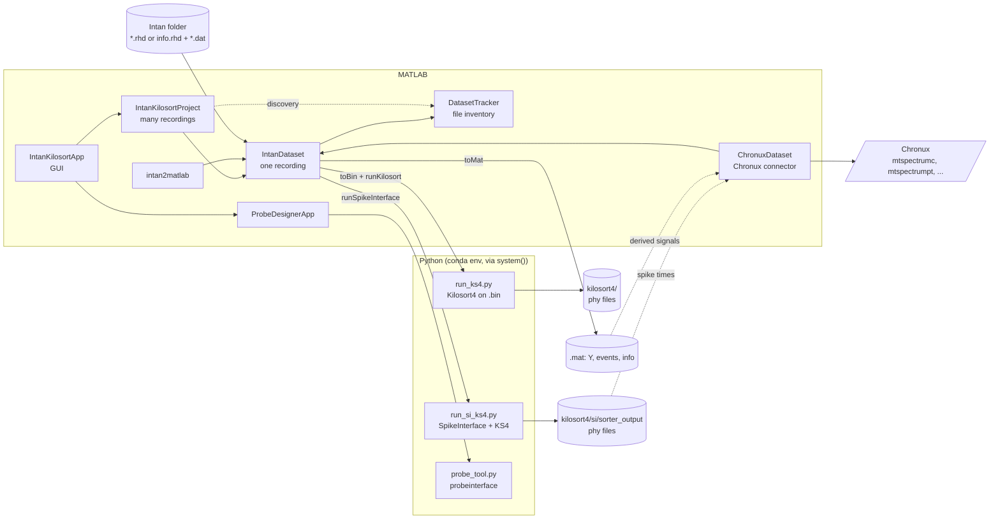

# Intan pipeline documentation

This folder is the reference for the Intan code in
[`intan`](../intan). That code reads Intan RHD recordings in MATLAB,
prepares them for **Kilosort4** (directly, or through **SpikeInterface**),
reviews the sorted units, exports LFP / MUA / spike-band signals, and connects
those signals and the sorted spike trains to the **Chronux** toolbox.

> Written 2026-09-11 from the source in the working tree, including changes not
> yet committed at the time (`deriveSignals.m` and `toMat.m` were untracked
> files). Another session was editing the LFP-filter / Convert code while this
> was written; those pages carry a note. When the code and these pages disagree,
> the code is authoritative.

## Pages

| Page | Covers |
| --- | --- |
| [IntanDataset](IntanDataset.md) | one recording: layouts, metadata, reading, streaming, filtering, artifacts, `.bin` writing, both Kilosort4 engines, derived signals, manifest |
| [IntanKilosortProject](IntanKilosortProject.md) | discovering many recordings and batch operations |
| [DatasetTracker](DatasetTracker.md) | read-only filesystem inventory (recordings, probe maps, `.bin` files, Kilosort4 runs) |
| [IntanKilosortApp](IntanKilosortApp.md) | the GUI, tab by tab |
| [ProbeDesignerApp](ProbeDesignerApp.md) | building a Kilosort4 probe `.json` from probeinterface |
| [intan2matlab](intan2matlab.md) | `intan2matlab` / `deriveSignals` / `toMat`: LFP, MUA, SPIKE and digital events |
| [ChronuxDataset](ChronuxDataset.md) | connector that hands recordings, trials and spike trains to the Chronux toolbox |
| [Python drivers](python-drivers.md) | `run_si_ks4.py`, `run_ks4.py`, `probe_tool.py` |
| [Files on disk](file-formats.md) | folder layout and every JSON / `.bin` / `.mat` schema |

Existing docs next to the code: [INSTALL.md](../intan/INSTALL.md) (Windows
setup, conda environments, GPU) and
[probes/README.md](../intan/probes/README.md) (probe map format).

## How the pieces fit



There are **two Kilosort4 engines**:

| Engine | Method | Writes a `.bin`? | Used by |
| --- | --- | --- | --- |
| SpikeInterface | `IntanDataset.runSpikeInterface` | no; SpikeInterface reads the raw files | the GUI's **Run Kilosort4** |
| legacy `.bin` | `IntanDataset.toBin` + `runKilosort` | yes | scripts, `IntanKilosortProject.toBinAll` / `runKilosortAll` |

## Quick start

GUI:

```matlab
addpath_nogit('C:\src\ephys_analysis')   % once per session (see INSTALL.md)
IntanKilosortApp
```

Script, SpikeInterface engine:

```matlab
ds = IntanDataset("D:\rec\subj1_day1");
ds.ProbeFile = "C:\src\ephys_analysis\intan\probes\H64LP_4x16lin_probemap.json";
ds.PythonExe = "C:\Users\me\miniconda3\envs\kilosort\python.exe";
res = ds.runSpikeInterface();        % blocks until Kilosort4 finishes
ds.kilosortResultsDir()              % folder with params.py for phy
```

Script, derived signals:

```matlab
[Y, events, info] = intan2matlab("D:\rec\subj1_day1", dataTypeOut=["LFP" "MUA"]);
```

Script, Chronux spectra (needs [Chronux](http://chronux.org) on the path):

```matlab
cx = ChronuxDataset("D:\rec\subj1_day1", Signal="LFP");
cx.Tapers = ChronuxDataset.tapersFor(2, 10);          % +/-2 Hz over 10 s
[data, params] = cx.continuous(Channels=1, TimeRange=[0 10]);
[S, f] = mtspectrumc(data, params);
```

## Conventions

### Supported layouts

| Layout | Files |
| --- | --- |
| traditional | `*.rhd` with embedded data |
| one-file-per-signal | `info.rhd` + `amplifier.dat` |
| one-file-per-channel | `info.rhd` + `amp-*.dat` |

All three read identically through `streamPlan` / `readChunkUV`. See
[IntanDataset → Supported recording layouts](IntanDataset.md#supported-recording-layouts).

### Units

- Amplifier data is in **microvolts** everywhere in MATLAB.
- `toBin` multiplies by `Scale` (default `1/0.195`) to go back to int16 ADC
  counts. Out-of-range values are clipped, counted and warned about.

### Channel indexing

| Where | Base | Meaning |
| --- | --- | --- |
| MATLAB channel lists: `ExcludeChannels`, `KeepChannels`, `ChannelOrder`, GUI fields | 1-based | amplifier channels in header order (= `.bin` rows) |
| Kilosort4 probe `chanMap` | 0-based | `.bin` channel of each site is `chanMap + 1` |
| `si_config.json` `exclude_channels` | 0-based | positions |

`run_si_ks4.py` matches `chanMap` to recording channels by the **trailing number
of the channel ID**, not by position; see
[Channel-numbering caveat](python-drivers.md#channel-numbering-caveat).

### Time and indexing conventions

- `readData`'s `t`, the `info.*.time` vectors from `deriveSignals`, and manual
  artifact masks (`manualArtifactMask`: `ceil(t0·Fs)`…`floor(t1·Fs)`, 0-based)
  use **t = (row − 1) / Fs**.
- Digital-input event times (`readData`, `deriveSignals`, `intan2matlab`) and
  `detectArtifacts` intervals use **t = row / Fs** (1-based row). They are
  therefore one sample later than `t` for the same row.
- `run_si_ks4.py` converts silence periods back to frames with `round(t·Fs)`
  (0-based). So an automatically detected run is silenced starting one sample
  after its first flagged sample, and a run exactly one sample long is dropped
  (`artifactIntervals` discards intervals with `tEnd <= tStart`).
- Manual artifact periods and `artifactIntervals` output are
  **recording-relative** seconds (the first sample of the first file is t = 0).

### Source data is read-only

No class modifies `*.rhd` / `*.dat` files. Sorting never modifies the probe
`.json` it uses: channel exclusions go through a derived probe (legacy engine)
or SpikeInterface channel removal. Artifacts are zeroed in the written `.bin` or
in the SpikeInterface recording, never in the source. Probe files are changed
only by explicit GUI actions: editing a Notes cell, a Designer save, or an
Import that you confirm should overwrite. The one file written **into the raw folder** is
`<Name>_manifest.json`. The GUI's Convert tab also writes its `.mat` there when
its output folder is left blank.

## Known behaviors and caveats

Collected from the code. Each is explained on the linked page.

| Topic | Behavior | Page |
| --- | --- | --- |
| Manual artifact periods | kept only in memory (`ManualArtifacts`); not in the manifest or preferences, lost on re-scan / close. The periods a run used are recorded in its `si_config.json` | [App → Visualize](IntanKilosortApp.md#visualize) |
| Artifacts tab threshold | the GUI always sends the Threshold field. With *Absolute microvolts* / *Common-mode* the default 9 means 9 µV, despite the "(SD)" label | [App → Artifacts](IntanKilosortApp.md#artifacts) |
| Artifacts preview filter | "High-pass before detecting" affects the preview only; run-time silencing detects on broadband data | [App → Artifacts](IntanKilosortApp.md#artifacts) |
| Visualize overlay | orange auto-detections are computed on the display-processed (and possibly decimated) data, so they may differ from what a run silences | [App → Visualize](IntanKilosortApp.md#visualize) |
| Visualize decimation | tail samples of each chunk that do not fill a bin are dropped, so displayed time can lag true time by up to (factor−1) samples per chunk | [App → Visualize](IntanKilosortApp.md#visualize) |
| Review firing rates | spike count ÷ time of the **last spike**, not the recording duration. Sample rate falls back to 30 kHz silently if not found | [App → Review](IntanKilosortApp.md#review) |
| Review waveforms | templates × median amplitude (unwhitened when possible), not raw-spike averages | [App → Review](IntanKilosortApp.md#review) |
| Review dataset dropdown | only populated when a scan finds no datasets; after a normal scan use Browse... | [App → Review](IntanKilosortApp.md#review) |
| SpikeInterface exclusions | manual exclusions are unioned with auto bad channels and follow `BadChannelAction`, so they are interpolated when the action is "interpolate" | [IntanDataset → Channel exclusions](IntanDataset.md#channel-exclusions) |
| SpikeInterface probe mapping | `chanMap` is matched by channel-ID number; multi-port recordings (`A-000` and `B-000`) collide | [Python drivers](python-drivers.md#channel-numbering-caveat) |
| Background runs | automatic artifact detection runs synchronously in MATLAB before each launch; closing the app does not stop running Python processes | [App → Kilosort](IntanKilosortApp.md#kilosort) |
| Manifest `kilosort.state` | for the SpikeInterface engine it is the tracker's fallback `"done"` whenever results exist; the true state is in `kilosort4/ks4_status.json` | [Files on disk](file-formats.md#dataset-manifest) |
| Derived-signal bad channels | interpolation is across neighboring **columns**, not probe geometry | [intan2matlab](intan2matlab.md#processing-order) |
| Chronux trial onsets | a dig-in onset maps to sample `round(t·Fs)` of the signal being epoched, so at a derived rate it is accurate to ±1 sample; Chronux's own `createdatamatc` indexes one sample later | [ChronuxDataset](ChronuxDataset.md#trial-sample-alignment) |
| Chronux point-process grid | left to itself `mtspectrumpt` normalizes by the span of the spikes, not the recording; pass the `t` the connector returns | [ChronuxDataset](ChronuxDataset.md#why-t-matters-for-point-processes) |
| MATLAB version | [INSTALL.md](../intan/INSTALL.md) says R2021a+, but the Visualize tab uses `xregion` (R2023a+) | [App → Visualize](IntanKilosortApp.md#visualize) |

## Dependencies

**MATLAB**:

- Signal Processing Toolbox (required for filtering, resampling and derived
  signals).
- Image Processing Toolbox (optional; `bwlabel`, with a fallback).
- Statistics and Machine Learning Toolbox (only for `zscore` in automatic
  derived-signal bad-channel detection).

**Functions from elsewhere in this repository**:

| Function | Used by |
| --- | --- |
| [`read_Intan_RHD2000_file_modified`](../intan/read_Intan_RHD2000_file_modified.m) | traditional `*.rhd` reader |
| [`matrix2kilosort`](../matrix2kilosort.m) | `IntanDataset.matrixToBin` |
| [`MultiChannelViewer`](../vendor/plotting/@MultiChannelViewer/MultiChannelViewer.m) | GUI Visualize tab |
| [`Manifest`](../vendor/tools/Manifest.m) | optional provenance log |
| [`parfor_progress`](../vendor/compute/parfor_progress.m) | `intan2matlab` console progress |
| [`addpath_nogit`](../addpath_nogit.m) | path setup |

**Python**: a conda environment with spikeinterface, kilosort, probeinterface,
neo and torch, plus an optional separate `phy` environment. See
[INSTALL.md](../intan/INSTALL.md) for known-good versions.

**Optional external MATLAB toolbox**: [Chronux](http://chronux.org), only for
running the analyses `ChronuxDataset` prepares data for. It is not bundled here;
add it with `addpath(genpath(...))`. Preparing the data never calls it
(`ChronuxDataset.hasChronux` reports whether it is on the path).

## Notes for maintainers

These are places where comments or older notes in the source no longer match the
code:

- `IntanKilosortApp.m`'s header describes the Kilosort tab as "(.bin then KS4)".
  The batch now runs `runSpikeInterface` only and writes no `.bin`.
- `buildArtifactsTab.m` refers to a "Blank artifacts in .bin" checkbox. The
  control is **Silence artifacts (manual always; auto-detect when ticked)** on
  the Kilosort tab.
- `CLAUDE TO DO.md` (a completed task list) mentions a `Bin` column in the
  Datasets table and `.bin` writing in `onRunBatch`; neither is in the current
  code.
- INSTALL.md's troubleshooting mentions `conda run -n phy2 phy`, while the
  default command and the setup steps use an env named `phy`.
- `IntanDataset.parseChannelList` uses `str2num`, which evaluates the field text
  as a MATLAB expression.
