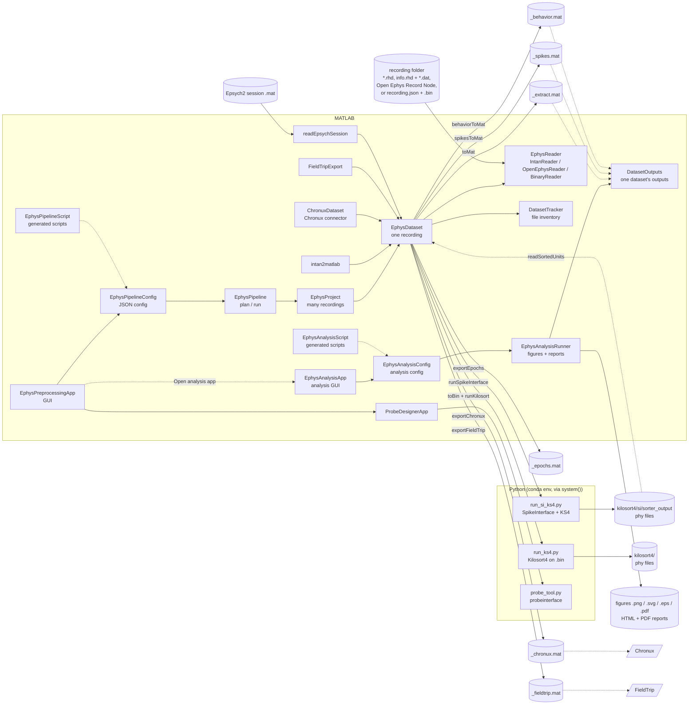

# Pipeline documentation

This folder is the reference for the code in [`pipeline`](../pipeline): a
config-driven preprocessing pipeline for extracellular recordings. It reads
recordings through an acquisition-agnostic reader layer (Intan RHD and Open
Ephys GUI sessions in its Binary, Open Ephys and NWB formats out of the box,
anything else through a universal binary format), screens them for
artifacts, sorts them with **Kilosort4** through **SpikeInterface**
(optional), derives LFP / MUA / spike-band signals, detects spikes and collects
sorted units, associates **Epsych2** behavior sessions, and exports files for
the **Chronux** and **FieldTrip** toolboxes. One JSON config drives the GUI,
the headless runner and generated scripts.

> Written 2026-09-11 and revised 2026-09-16 from the source in the working
> tree. When the code and these pages disagree, the code is authoritative.

The [`analysis`](../analysis) folder draws quick-look figures (PSTHs, evoked
potentials, rates, tuning curves, heatmaps, probe maps) and reports from the
pipeline's outputs, with its own config, runner, scripts and GUI. It depends
on `pipeline`; `pipeline` does not depend on it. See [Analysis](EphysAnalysis.md).

## Pages

| Page | Covers |
| --- | --- |
| [EphysPipeline](EphysPipeline.md) | `EphysPipelineConfig` (the config and its schema), `EphysPipeline` (plan / run / cancel; background Kilosort4 runs N at a time over the listed GPUs: `sortingSlot`, `waitForSortingSlot`), `EphysPipelineScript` (generated scripts), Epsych2 session readers |
| [EphysDataset](EphysDataset.md) | one recording: readers and the universal data struct, layouts, metadata, streaming, filtering, artifacts, spike detection, `.bin` writing, both Kilosort4 engines, sorted-unit loader, derived signals, spikes file, exports, behavior, manifest |
| [EphysProject](EphysProject.md) | discovering many recordings, `refresh`, dataset keys, batch operations |
| [DatasetTracker](DatasetTracker.md) | read-only filesystem inventory (recordings, probe maps, `.bin` files, Kilosort4 runs) |
| [DatasetOutputs](DatasetOutputs.md) | one dataset's processed files (signals, spikes, behavior, exports, sorted units), found wherever they live and loaded on demand |
| [EphysPreprocessingApp](EphysPreprocessingApp.md) | the GUI, tab by tab, its config model and preferences |
| [Copying sessions](EphysPreprocessingApp.md#copy) | `findCopySessions`, `stitchCopySessions`, `copySessions`, `CopySchedule`: pairing recording folders (Intan RHX, Open Ephys GUI sessions) with ePsych files on the source and copying them to local session folders, by hand or on a schedule |
| [ProbeDesignerApp](ProbeDesignerApp.md) | building a Kilosort4 probe `.json` from probeinterface |
| [intan2matlab](intan2matlab.md) | `intan2matlab` / `deriveSignals` / `toMat`: LFP, MUA, SPIKE and digital events |
| [ChronuxDataset](ChronuxDataset.md) | connector that hands recordings, trials and spike trains to the Chronux toolbox |
| [FieldTripExport](FieldTripExport.md) | FieldTrip raw / spike / event structures and `exportFieldTrip` |
| [Analysis](EphysAnalysis.md) | the `analysis` folder: event references, epochs, trial selection and grouping, PSTH / evoked / rate / tuning computations, renderers, export, HTML / PDF reports, `EphysAnalysisRunner`, `EphysAnalysisScript` |
| [EphysAnalysisConfig](EphysAnalysisConfig.md) | the analysis config (JSON `ephys-analysis-config`): every field, plot kinds, validation, tokens |
| [EphysAnalysisApp](EphysAnalysisApp.md) | the analysis GUI: Data, Alignment, Plots, Export and Log tabs, preferences, why a plot is skipped |
| [Python drivers](python-drivers.md) | `run_si_ks4.py`, `run_ks4.py`, `probe_tool.py` |
| [Files on disk](file-formats.md) | folder layout and every JSON / `.bin` / `.mat` schema |
| [Remote jobs](remote-jobs.md) | **design proposal, not implemented** — running the pipeline as queued jobs on a remote Windows machine, monitored from MATLAB or a browser |

Existing docs next to the code: [INSTALL.md](../pipeline/INSTALL.md) (Windows
setup, conda environments, GPU) and
[probes/README.md](../pipeline/probes/README.md) (probe map format).

## How the pieces fit



**Steps** of a run, in order (each optional except the probe preflight):
`probe` → `behavior` → `artifacts` → `sorting` → `signals` → `spikes` →
`export`. See [EphysPipeline](EphysPipeline.md#run).

There are **two Kilosort4 engines**:

| Engine | Method | Writes a `.bin`? | Used by |
| --- | --- | --- | --- |
| SpikeInterface | `EphysDataset.runSpikeInterface` | no; SpikeInterface reads the raw files | the pipeline's `sorting` step with `Sorting.Engine = "spikeinterface"` (the default) |
| native Kilosort4 | `EphysDataset.runKilosort` (calls `toBin`) | yes, with the artifact periods zeroed | the `sorting` step with `Sorting.Engine = "kilosort"` |

## Quick start

GUI:

```matlab
addpath_nogit('C:\src\ephys_analysis')   % once per session (see INSTALL.md)
EphysPreprocessingApp
```

Config + runner (what the GUI does):

```matlab
cfg = EphysPipelineConfig.load("D:\EPHYS\pipeline.json");   % File > Save config in the GUI
pipe = EphysPipeline(cfg);
disp(pipe.plan())
R = pipe.run();
```

One dataset by hand:

```matlab
ds = EphysDataset("D:\rec\subj1_day1");
ds.ProbeFile = "C:\src\ephys_analysis\pipeline\probes\H64LP_4x16lin_probemap.json";
ds.PythonExe = "C:\Users\me\miniconda3\envs\kilosort\python.exe";
res = ds.runSpikeInterface();        % blocks until Kilosort4 finishes
U   = ds.readSortedUnits();          % the sorted units (phy labels, times, channels)
out = ds.toMat(SignalOptions=struct('dataTypeOut', ["LFP" "MUA"]));
out = ds.spikesToMat(Source="both");
out = ds.exportChronux();  out = ds.exportFieldTrip();
E   = ds.eventEpochs(EventSource="behavior");   % the same data, one epoch per trial
out = ds.exportEpochs();                        % E, saved as _epochs.mat
```

Chronux spectra from the export (needs [Chronux](http://chronux.org) on the path):

```matlab
C = load("D:\out\subj1_day1\subj1_day1_chronux.mat");
[S, f] = mtspectrumc(C.LFP.data(:, 1), C.LFP.params);
```

## Conventions

### Supported recordings

| Reader | Layout | Files |
| --- | --- | --- |
| `IntanReader` | traditional | `*.rhd` with embedded data |
| `IntanReader` | one-file-per-signal | `info.rhd` + `amplifier.dat` |
| `IntanReader` | one-file-per-channel | `info.rhd` + `amp-*.dat` |
| `OpenEphysReader` | openephys-binary | an Open Ephys GUI session folder: `Record Node <id>/experiment*/recording*/structure.oebin` + `continuous.dat` |
| `OpenEphysReader` | openephys-legacy | `Record Node <id>/*.continuous` + `.events` (the Open Ephys format; GUI 0.4 / 0.5 names too) |
| `OpenEphysReader` | openephys-nwb | `Record Node <id>/experiment*.nwb` (NWB 2) |
| `BinaryReader` | binary (universal) | `recording.json` + one flat channel-major file |

All read identically through `streamPlan` / `readChunkUV` and return the same
in-memory struct. See
[EphysDataset → Acquisition readers](EphysDataset.md#acquisition-readers),
[Open Ephys sessions](EphysDataset.md#open-ephys-sessions) (recording modes,
record node / stream, TTL line names) and
[file-formats → recording.json](file-formats.md#universal-recording-format-recordingjson).

### Units

- Amplifier data is in **microvolts** everywhere in MATLAB.
- `toBin` multiplies by `Scale` (default `1/0.195`) to go back to int16 ADC
  counts. Out-of-range values are clipped, counted and warned about.

### Channel indexing

| Where | Base | Meaning |
| --- | --- | --- |
| MATLAB channel lists: `ExcludeChannels`, `KeepChannels`, `ChannelOrder`, config / GUI fields, `units.channel` | 1-based | amplifier channels in header order (= `.bin` rows) |
| `ChannelNumbers`, `units.channelNumber` | 0-based | hardware numbers (`A-012` → 12, Open Ephys `CH13` → 12) |
| Kilosort4 probe `chanMap` | 0-based | channel numbers; the `.bin` channel of each site is `chanMap + 1` when the numbers are positions |
| `si_config.json` `exclude_channels` | 0-based | positions |
| `units.ksChannel` | 1-based | among the **sorted** channels (after exclusions / bad-channel removal) |

`run_si_ks4.py` names the recording's channels by their **channel numbers** and
matches `chanMap` to them; see
[Channel-numbering caveat](python-drivers.md#channel-numbering-caveat).

### Time and indexing conventions

- `readData`'s `t`, the `info.*.time` vectors from `deriveSignals`, spike times
  (`detectSpikes`, `readSortedUnits`: `samples / fs`) and manual artifact masks
  use **t = (row − 1) / Fs**.
- Digital-input event times (`readData`, `deriveSignals`, `intan2matlab`) and
  `detectArtifacts` intervals use **t = row / Fs** (1-based row). They are
  therefore one sample later than `t` for the same row.
- `run_si_ks4.py` converts silence periods back to frames with `round(t·Fs)`
  (0-based). So an automatically detected run is silenced starting one sample
  after its first flagged sample, and a run exactly one sample long is dropped
  (`artifactIntervals` discards intervals with `tEnd <= tStart`).
- Manual artifact periods and `artifactIntervals` output are
  **recording-relative** seconds (the first sample of the first file is t = 0).
- FieldTrip `event.sample = round(t_on·Fs)` (1-based) and spike `timestamp` =
  the 0-based sorted sample; both share the recording clock through
  `hdr.TimeStampPerSample`.

### Source data is read-only

No class modifies recording files. Sorting never modifies the probe `.json` it
uses: channel exclusions go through a derived probe (legacy engine) or
SpikeInterface channel removal. Artifacts are zeroed in the written `.bin` or
in the SpikeInterface recording, never in the source. Probe files are changed
only by explicit GUI actions: editing a Notes cell, a Designer save, or an
Import that you confirm should overwrite. The files written **into the raw
folder** are `<Name>_manifest.json` and, for Open Ephys sessions in
`"separate"` mode, the part folders (`openephys-part.json`); everything else
goes to the output folder (`<OutputRoot>/<Name>`, or the recording folder when
no output root is set).

## Known behaviors and caveats

Collected from the code. Each is explained on the linked page.

| Topic | Behavior | Page |
| --- | --- | --- |
| Artifacts tab threshold | the GUI always sends the Threshold field. With *Absolute microvolts* / *Common-mode* the default 9 means 9 µV | [App → Artifacts](EphysPreprocessingApp.md#artifacts) |
| Visualize overlay | orange auto-detections are computed on the display-processed (and possibly decimated) data, so they may differ from what a run silences | [App → Visualize](EphysPreprocessingApp.md#visualize) |
| Visualize decimation | tail samples of each chunk that do not fill a bin are dropped, so displayed time can lag true time by up to (factor−1) samples per chunk | [App → Visualize](EphysPreprocessingApp.md#visualize) |
| Sorted-output association | a manual folder is restored on rescan only while its `params.py` exists; otherwise the dataset falls back to auto-discovery | [EphysDataset → Sorted output](EphysDataset.md#sorted-output) |
| Sorted waveforms | `templateWaveform` is the template × median amplitude, not a raw-spike average; raw waveforms at sorted spike times are not extracted | [EphysDataset → Reading sorted units](EphysDataset.md#reading-sorted-units) |
| Review firing rates | spike count ÷ time of the **last spike**, not the recording duration | [App → Review](EphysPreprocessingApp.md#review) |
| Epsych2 trials | loaded and stored next to the events; trials are **not** paired with digital-input onsets yet | [EphysPipeline → Epsych2](EphysPipeline.md#epsych2-sessions) |
| Background sorting + dependent steps | a background sorting run cannot feed `Spikes` (sorted) or `Export` (units) in the same run; `validate` reports it | [EphysPipeline → Validation](EphysPipeline.md#validation) |
| Duplicate dataset names | two selected datasets with the same leaf name and one output root would collide; `plan()` stops the run | [EphysPipeline → Dataset keys](EphysPipeline.md#dataset-keys) |
| SpikeInterface exclusions | manual exclusions are unioned with auto bad channels and follow `BadChannelAction`, so they are interpolated when the action is "interpolate" | [EphysDataset → Channel exclusions](EphysDataset.md#channel-exclusions) |
| SpikeInterface probe mapping | `chanMap` is matched by channel number; a multi-port Intan recording (`A-000` and `B-000`) is numbered by position instead, with a warning | [Python drivers](python-drivers.md#channel-numbering-caveat) |
| Open Ephys TTL lines at a recording start | a line already high when a recording starts is seen from Binary always, from NWB when that recording has any TTL edge, and from the Open Ephys format only when its first edge there is falling; intervals are split at recording boundaries | [EphysDataset → Open Ephys sessions](EphysDataset.md#open-ephys-sessions) |
| Open Ephys samples | rows are the stored samples (dropped samples are not zero-filled; a warning lists them); the Open Ephys format zero-pads each recording's last record, as the GUI writes it | [EphysDataset → Open Ephys sessions](EphysDataset.md#open-ephys-sessions) |
| Open Ephys AUX | stored as (raw − 32768) × 37.4 µV: 1.2255 V below Intan RHX's volts for the same accelerometer | [EphysDataset → Open Ephys sessions](EphysDataset.md#open-ephys-sessions) |
| Open Ephys NWB sorting | the SpikeInterface engine needs h5py in the sorting environment; the native engine does not | [Python drivers](python-drivers.md#run_si_ks4py) |
| Background runs | at most `Sorting.MaxConcurrent` (default 1) at a time, so the run stays busy until the last dataset has started, unless the Run tab's **Queue the waiting runs** hands the rest to the monitor; automatic artifact detection runs synchronously in MATLAB before each launch (then cached); closing the app does not stop running Python processes, but drops the queued ones | [App → Run](EphysPreprocessingApp.md#run) |
| Manifest `kilosort.state` | for the SpikeInterface engine it is the tracker's fallback `"done"` whenever results exist; the true state is in `kilosort4/ks4_status.json` | [Files on disk](file-formats.md#dataset-manifest) |
| Derived-signal bad channels | interpolation is across neighboring **columns**, not probe geometry | [intan2matlab](intan2matlab.md#processing-order) |
| Chronux trial onsets | a dig-in onset maps to sample `round(t·Fs)` of the signal being epoched, so at a derived rate it is accurate to ±1 sample; Chronux's own `createdatamatc` indexes one sample later | [ChronuxDataset](ChronuxDataset.md#trial-sample-alignment) |
| Chronux point-process grid | left to itself `mtspectrumpt` normalizes by the span of the spikes, not the recording; pass the `t` the connector returns | [ChronuxDataset](ChronuxDataset.md#why-t-matters-for-point-processes) |
| MATLAB version | the Visualize tab uses `xregion` (R2023a+); the code is developed on R2025a | [INSTALL.md](../pipeline/INSTALL.md) |
| Parallel steps | the worker count is capped by free memory (4-5 on a 32 GB machine), not by the pool size; every worker reads the disk, so on a slow external disk a parallel step can be no faster than serial; the results are identical either way | [EphysPipeline → Parallel execution](EphysPipeline.md#parallel-execution) |

## Dependencies

**MATLAB**:

- Signal Processing Toolbox (required for filtering, resampling and derived
  signals).
- Image Processing Toolbox (optional; `bwlabel`, with a fallback).
- Statistics and Machine Learning Toolbox (only for `zscore` in automatic
  derived-signal bad-channel detection).
- Parallel Computing Toolbox (optional; `Parallel.Enabled` in a pipeline
  config, or `UseParallel=true` on `detectSpikes`, `artifactIntervals` and
  `analyzeArtifacts`).
- No Report Generator: the analysis module's PDF reports are built with
  `exportgraphics(..., Append=true)` and its HTML reports by hand.

**Functions from elsewhere in this repository**:

| Function | Used by |
| --- | --- |
| [`read_Intan_RHD2000_file_modified`](../pipeline/read_Intan_RHD2000_file_modified.m) | `IntanReader`, traditional `*.rhd` |
| [`matrix2kilosort`](../matrix2kilosort.m) | `EphysDataset.matrixToBin` |
| [`MultiChannelViewer`](../vendor/plotting/@MultiChannelViewer/MultiChannelViewer.m) | GUI Visualize tab |
| [`Manifest`](../vendor/tools/Manifest.m) | optional provenance log |
| [`parfor_progress`](../vendor/compute/parfor_progress.m) | `intan2matlab` console progress |
| [`addpath_nogit`](../addpath_nogit.m) | path setup |

**Python**: a conda environment with spikeinterface, kilosort, probeinterface,
neo and torch (plus h5py to sort Open Ephys NWB sessions with the SpikeInterface
engine), plus an optional separate `phy` environment. Needed only for
the sorting step and the probe designer. See [INSTALL.md](../pipeline/INSTALL.md)
for known-good versions.

**Optional MATLAB toolboxes**: [Chronux](http://chronux.org) (bundled in
[`toolboxes/chronux`](../toolboxes/chronux); add it with `addpath(genpath(...))`)
and [FieldTrip](https://www.fieldtriptoolbox.org/), each only for analysing the
files the pipeline exports for it. Producing the files never calls either
toolbox; `ChronuxDataset.hasChronux` / `FieldTripExport.hasFieldTrip` report
whether they are on the path, and the FieldTrip export validates its
structures with `ft_datatype_*` when FieldTrip is present.

## Tests

Every suite is a function-style script that builds synthetic fixtures in a
temp folder (shared builders in [`pipeline/private`](../pipeline/private)), prints
PASS / FAIL lines and errors when anything fails. No real recordings, no
Python and no optional toolbox are needed.

For trying the pipeline or the app by hand without real data,
[`makeSyntheticProject`](../pipeline/makeSyntheticProject.m) (or the app's
**File → Create synthetic test project...**) writes a realistic project:
recordings with spiking units, LFP, artifacts, the lab's six digital lines
and accelerometer inputs, an Epsych2 session per recording, ground-truth
sorted output and a ready pipeline config. See
[EphysPreprocessingApp → Synthetic test project](EphysPreprocessingApp.md#synthetic-test-project).

```matlab
cd C:\src\ephys_analysis\pipeline
run_all_tests            % every test_*.m; errors if any fails
test_EphysPipeline       % one suite
```

| Suite | Covers |
| --- | --- |
| `test_EphysDataset` | readers, layouts, streaming, artifacts, spikes, `.bin`, dry runs, manifest v2, sorted units, `spikesToMat`, exports, behavior |
| `test_OpenEphysReader` | Open Ephys sessions (Binary, Open Ephys format, NWB): metadata, samples across recordings and gaps, TTL lines, AUX / ADC, discovery, record node / stream, the recording modes, line names, the pipeline on a synthetic Open Ephys project, the SpikeInterface loaders |
| `test_EphysProject` (in `test_EphysDataset` §7 / §15) | discovery, keys, `refresh` |
| `test_DatasetTracker` | the filesystem inventory |
| `test_ChronuxDataset` | the Chronux connector |
| `test_FieldTripExport` | the FieldTrip structures |
| `test_EventEpochs` | the event-organized export: sample alignment, spike windows, the trials table, the behavior source, the epoch settings |
| `test_EpsychSession` | Epsych2 readers and matching |
| `test_EphysPipelineConfig`, `test_EphysPipeline`, `test_EphysPipelineScript` | config, runner, scripts |
| `test_EphysPreprocessingApp` | the GUI's config model, headless |
| `test_SyntheticDataset` | `makeSyntheticProject` / `makeSyntheticRecording`: the written lines, sessions, spikes, aux and artifacts read back; pairing per scenario; the other layouts (Open Ephys included); the config through the pipeline; the app's File-menu action |
| `test_EphysAnalysisCompute` (analysis/) | compute functions on seeded spike trains and signals, the trial-filter compiler, every renderer |
| `test_EphysAnalysisEpochs` (analysis/) | sources, event references, epochs, trial selection and grouping against the synthetic truth |
| `test_EphysAnalysisConfig` (analysis/) | the analysis config: JSON round trips, `plotFor`, validation |
| `test_EphysAnalysisRunner` (analysis/) | plan, run, exports, HTML / PDF reports, cancel, compact vs standalone script equivalence |
| `test_EphysAnalysisApp` (analysis/) | the analysis GUI, headless |
