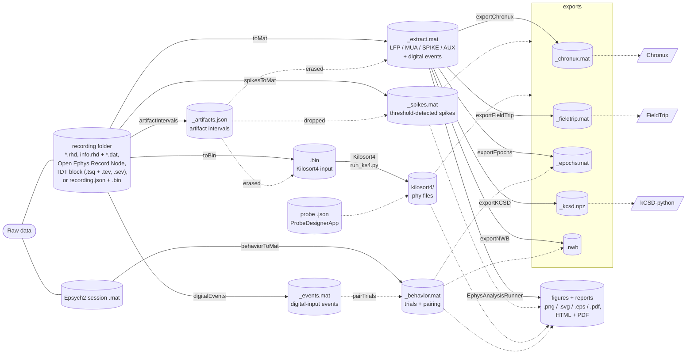

# Pipeline documentation

This folder is the reference for the code in [`pipeline`](../pipeline): a
config-driven preprocessing pipeline for extracellular recordings. It reads
recordings through an acquisition-agnostic reader layer (Intan RHD and Open
Ephys GUI sessions in its Binary, Open Ephys and NWB formats out of the box,
anything else through a universal binary format), screens them for
artifacts, sorts them with **Kilosort4** on a `.bin` (optional), derives LFP / MUA / spike-band signals, detects spikes and collects
sorted units, associates **Epsych2** behavior sessions, and exports files for
the **Chronux** and **FieldTrip** toolboxes. One JSON config drives the GUI,
the headless runner and generated scripts.

> Written 2026-09-11 and revised 2026-09-23 from the source in the working
> tree. When the code and these pages disagree, the code is authoritative.

The [`analysis`](../analysis) folder draws quick-look figures (PSTHs, evoked
potentials, rates, tuning curves, heatmaps, probe maps) and reports from the
pipeline's outputs, with its own config, runner, scripts and GUI. It depends
on `pipeline`; `pipeline` does not depend on it. See [Analysis](EphysAnalysis.md).

## Pages

| Page | Covers |
| --- | --- |
| [EphysPipeline](EphysPipeline.md) | `EphysPipelineConfig` (the config and its schema), `EphysPipeline` (plan / run / cancel; background Kilosort4 runs N at a time over the listed GPUs: `sortingSlot`, `waitForSortingSlot`; the Analysis step, which runs an analysis config's figures and report over the selected datasets), `EphysPipelineScript` (generated scripts), Epsych2 session readers |
| [EphysDataset](EphysDataset.md) | one recording: readers and the universal data struct, layouts, metadata, streaming, filtering, artifacts, spike detection, `.bin` writing, Kilosort4 runs, sorted-unit loader, derived signals, spikes file, exports, behavior, manifest |
| [EphysProject](EphysProject.md) | discovering many recordings, `refresh`, dataset keys, batch operations |
| [DatasetTracker](DatasetTracker.md) | read-only filesystem inventory (recordings, probe maps, `.bin` files, Kilosort4 runs) |
| [DatasetOutputs](DatasetOutputs.md) | one dataset's processed files (signals, spikes, behavior, exports, sorted units), found wherever they live and loaded on demand |
| [EphysPipelineApp](EphysPipelineApp.md) | the GUI, tab by tab, its config model and preferences |
| [Copying sessions](EphysPipelineApp.md#copy) | `findCopySessions`, `stitchCopySessions`, `copySessions`, `CopySchedule`: pairing recording folders (Intan RHX, Open Ephys GUI sessions) with ePsych files on the source and copying them to local session folders, by hand or on a schedule |
| [ProbeDesignerApp](ProbeDesignerApp.md) | building a Kilosort4 probe `.json` from probeinterface |
| [ChannelMapperApp](ChannelMapperApp.md) | mapping probe sites through the package and headstage (NeuroNexus packages, Intan headstages, the `pipeline/hardware` bank) to recording rows; copying the map; exporting the Kilosort4 probe `.json` (`ChannelMap`, `HardwareBank`) |
| [ManifestViewerApp](ManifestViewerApp.md) | viewing one dataset manifest, with its paths checked on disk |
| [Visualize](EphysPipelineApp.md#visualize) | `EphysTraceSource` (the recording, the Sorting `.bin` or a derived signal, read a window at a time), `EphysTraceEnvelope` (its min / max at several block sizes, cached on disk and built in the background, for views wider than one read) and `EphysTraceViewer` (stacked lanes with sorted units and detected spikes over them), behind the app's Visualize tab |
| [intan2matlab](intan2matlab.md) | `intan2matlab` / `deriveSignals` / `toMat`: LFP, MUA, SPIKE and digital events |
| [ChronuxDataset](ChronuxDataset.md) | connector that hands recordings, trials and spike trains to the Chronux toolbox |
| [FieldTripExport](FieldTripExport.md) | FieldTrip raw / spike / event structures and `exportFieldTrip` |
| [Platforms](platforms.md) | what runs on Windows, macOS and Linux; `platformSupport`, `openInSystem` |
| [Analysis](EphysAnalysis.md) | the `analysis` folder: event references, epochs, trial selection and grouping, PSTH / evoked / rate / tuning computations, response statistics, population analysis, renderers, export, HTML / PDF reports, `EphysAnalysisRunner`, `EphysAnalysisScript` |
| [EphysAnalysisConfig](EphysAnalysisConfig.md) | the analysis config (JSON `ephys-analysis-config`): every field, plot kinds, validation, tokens |
| [EphysAnalysisApp](EphysAnalysisApp.md) | the analysis GUI: Data, Alignment, Plots, Export and Log tabs, preferences, why a plot is skipped |
| [Python drivers](python-drivers.md) | `run_ks4.py`, `probe_tool.py` |
| [Kilosort4 notes](kilosort4-notes.md) | Kilosort4 parameters its documentation does not settle, worked out from its source: `whitening_range`, and `shank_spacing` (moving the shanks apart for the sort only) |
| [Files on disk](file-formats.md) | folder layout and every JSON / `.bin` / `.mat` schema |
| [Remote jobs](remote-jobs.md) | **design proposal, not implemented** — running the pipeline as queued jobs on a remote Windows machine, monitored from MATLAB or a browser |

Existing docs next to the code: [INSTALL.md](../pipeline/INSTALL.md) (Windows
setup, conda environments, GPU),
[probes/README.md](../pipeline/probes/README.md) (probe map format) and
[tools/wiki/README.md](../tools/wiki/README.md) (updating the GitHub wiki, whose prose pages are generated
from this folder, the one source (`gen_pages.py`):
the API generator, the link check and the app screenshots).

## How the pieces fit


```mermaid
flowchart LR
    RAW(["Raw data"])
    RAW --- REC[("recording folder<br/>*.rhd, info.rhd + *.dat,<br/>Open Ephys Record Node,<br/>TDT block (.tsq + .tev, .sev),<br/>or recording.json + .bin")]
    RAW --- BEH[(Epsych2 session .mat)]

    REC -- digitalEvents --> EVT[("_events.mat<br/>digital-input events")]
    REC -- artifactIntervals --> ART[("_artifacts.json<br/>artifact intervals")]
    REC -- toBin --> BIN[(".bin<br/>Kilosort4 input")]
    REC -- toMat --> MAT[("_extract.mat<br/>LFP / MUA / SPIKE / AUX<br/>+ digital events")]
    REC -- spikesToMat --> SPK[("_spikes.mat<br/>threshold-detected spikes")]
    BEH -- behaviorToMat ----> BMAT[("_behavior.mat<br/>trials + pairing")]

    ART -. erased .-> BIN
    ART -. erased .-> MAT
    ART -. dropped .-> SPK
    BIN -- "Kilosort4<br/>run_ks4.py" --> KS[("kilosort4/<br/>phy files")]
    PRB[("probe .json<br/>ProbeDesignerApp")] -.-> KS
    EVT -. pairTrials .-> BMAT

    subgraph EXP["exports"]
        CHX[(_chronux.mat)]
        FTX[(_fieldtrip.mat)]
        EPO[(_epochs.mat)]
        KCX[(_kcsd.npz)]
        NWBX[(.nwb)]
    end
    MAT -- exportChronux --> CHX
    MAT -- exportFieldTrip --> FTX
    MAT -- exportEpochs --> EPO
    MAT -- exportKCSD --> KCX
    MAT -- exportNWB --> NWBX
    SPK & KS -.-> EXP
    BMAT -.-> EPO & NWBX
    CHX -.-> CHRONUX[/Chronux/]
    FTX -.-> FIELDTRIP[/FieldTrip/]
    KCX -.-> KCSD[/kCSD-python/]

    MAT -- EphysAnalysisRunner --> FIGS[("figures + reports<br/>.png / .svg / .eps / .pdf,<br/>HTML + PDF")]
    SPK & KS & BMAT -.-> FIGS
```

Each file hangs from the one it is made from, and the solid arrow names what
makes it (mostly an `EphysDataset` method); dashed arrows are further inputs.
Behavior pairing reads the cached digital events. The artifact periods are
erased in the `.bin` and, before any filter, in the data LFP / MUA / SPIKE are
derived from (`Signals.BlankArtifacts`, which also records them in
`_extract.mat`), and threshold detection drops the spikes inside them or, with
`Spikes.ArtifactMode = "erase"`, erases them before it filters. The exports
and the analysis take their signals, events and artifact periods from
`_extract.mat` (epochs that touch a period are dropped by default), detected
spikes from `_spikes.mat` and sorted units straight from `kilosort4/`; epochs and figures also read the
paired trials in `_behavior.mat`. The common reference (CAR / CMR), when set,
is subtracted once as each step reads the recording, so artifact detection, the
`.bin` (Kilosort4's own `do_CAR` is then off) and threshold detection all see
it, and so do the derived signals ticked for it (MUA and SPIKE by default; the
LFP is kept as recorded).

The code that drives the tree: `EphysPipelineApp` or a generated
`EphysPipelineScript` sets up an `EphysPipelineConfig`, and `EphysPipeline`
runs its steps over an `EphysProject`, one `EphysDataset` per recording, read
through an `EphysReader` (`IntanReader` / `OpenEphysReader` / `TDTReader` / `BinaryReader`).
`readEpsychSession` reads the Epsych2 session, `intan2matlab` is a thin
wrapper around `deriveSignals` (what `toMat` saves), `exportChronux` packages
through `ChronuxDataset` and `exportFieldTrip` through `FieldTripExport`, and
`DatasetTracker` keeps the inventory of files on disk. Each dataset keeps its
state in `<Name>_manifest.json` (`writeManifest` / `applyManifest`), which
`ManifestViewerApp` shows (**Dataset → View manifest...**). Kilosort4
(`run_ks4.py`) and probeinterface (`probe_tool.py`, behind `ProbeDesignerApp`)
run in a conda Python through `system()`. On the analysis side,
`EphysAnalysisApp` or an `EphysAnalysisScript` sets up an
`EphysAnalysisConfig`, and `EphysAnalysisRunner` reads the processed files
through `DatasetOutputs`, never the recording.

**Steps** of a run, in order (each optional except the probe preflight):
`probe` → `behavior` → `artifacts` → `sorting` → `signals` → `spikes` →
`export`. See [EphysPipeline](EphysPipeline.md#run).

Sorting has one path: `EphysDataset.runKilosort` writes the recording to a
`.bin` (`toBin`, artifact periods erased) and runs Kilosort4 on it.

The artifact periods (the manual ones, plus the automatic detection per
`Artifacts.ApplyToSorting` / `ApplyToSignals` / `ApplyToSpikes`) reach three
steps: Sorting erases them in the `.bin`, Signals erases them in the amplifier
data before it derives LFP / MUA / SPIKE (`Signals.BlankArtifacts`; AUX and
the digital events are not touched), and Spikes either rejects the events
inside them or erases them before detection, so it runs on the cleaned
recording (`Spikes.ArtifactMode` `"reject"` / `"erase"`).

## Quick start

GUI:

```matlab
addpath_nogit('C:\src\ephys_analysis')   % once per session (see INSTALL.md)
EphysPipelineApp
```

Config + runner (what the GUI does):

```matlab
cfg = EphysPipelineConfig.load("D:\EPHYS\pipeline.json");   % File > Save config in the GUI
pipe = EphysPipeline(cfg);
disp(pipe.plan())
R = pipe.run();
```

One dataset by hand:

```matlab
ds = EphysDataset("D:\rec\subj1_day1");
ds.ProbeFile = "C:\src\ephys_analysis\pipeline\probes\H64LP_4x16lin_probemap.json";
ds.PythonExe = "C:\Users\me\miniconda3\envs\kilosort\python.exe";
res = ds.runKilosort();              % writes the .bin, blocks until Kilosort4 finishes
U   = ds.readSortedUnits();          % the sorted units (phy labels, times, channels)
out = ds.toMat(SignalOptions=struct('dataTypeOut', ["LFP" "MUA"]));
out = ds.spikesToMat();             % threshold-detected spikes
out = ds.exportChronux();  out = ds.exportFieldTrip();
E   = ds.eventEpochs(EventSource="behavior");   % the same data, one epoch per trial
out = ds.exportEpochs();                        % E, saved as _epochs.mat
out = ds.exportKCSD();                          % LFP + probe positions for kCSD-python, _kcsd.npz
```

Chronux spectra from the export (needs [Chronux](http://chronux.org) on the path):

```matlab
C = load("D:\out\subj1_day1\subj1_day1_chronux.mat");
[S, f] = mtspectrumc(C.LFP.data(:, 1), C.LFP.params);
```

## Conventions

### Supported recordings

| Reader | Layout | Files |
| --- | --- | --- |
| `IntanReader` | traditional | `*.rhd` with embedded data |
| `IntanReader` | one-file-per-signal | `info.rhd` + `amplifier.dat` |
| `IntanReader` | one-file-per-channel | `info.rhd` + `amp-*.dat` |
| `OpenEphysReader` | openephys-binary | an Open Ephys GUI session folder: `Record Node <id>/experiment*/recording*/structure.oebin` + `continuous.dat` |
| `OpenEphysReader` | openephys-legacy | `Record Node <id>/*.continuous` + `.events` (the Open Ephys format; GUI 0.4 / 0.5 names too) |
| `OpenEphysReader` | openephys-nwb | `Record Node <id>/experiment*.nwb` (NWB 2) |
| `TDTReader` | tdt | a TDT Synapse / OpenEx block folder: `*.tsq` + `*.tev` (+ `*.Tbk`), and `*.sev` per channel for streams stored as discrete files; epoc stores are the event lines |
| `BinaryReader` | binary (universal) | `recording.json` + one flat channel-major file |

All read identically through `streamPlan` / `readChunkUV` and return the same
in-memory struct. See
[EphysDataset → Acquisition readers](EphysDataset.md#acquisition-readers),
[Open Ephys sessions](EphysDataset.md#open-ephys-sessions) (recording modes,
record node / stream, TTL line names) and
[file-formats → recording.json](file-formats.md#universal-recording-format-recordingjson).

### Units

- Amplifier data is in **microvolts** everywhere in MATLAB.
- `toBin` multiplies by the `.bin`'s units per µV: the recording's own
  resolution when one stored unit maps onto one int16 unit (Intan and Open
  Ephys headstage data: 1/0.195, so the `.bin` holds the ADC counts), else
  `1/0.195` (`EphysDataset.binScale`; the sidecar's `scale_source` says
  which). Out-of-range values are clipped, counted and warned about.

### Channel indexing

| Where | Base | Meaning |
| --- | --- | --- |
| MATLAB channel lists: `ExcludeChannels`, `KeepChannels`, `ChannelOrder`, config / GUI fields, `units.channel` | 1-based | amplifier channels in header order (= `.bin` rows) |
| `ChannelNumbers`, `units.channelNumber` | 0-based | hardware numbers (`A-012` → 12, Open Ephys `CH13` → 12); not `chanMap` values |
| Kilosort4 probe `chanMap` | 0-based | `.bin` rows: recording channel `c` sits at the site whose `chanMap` value is `c − 1`, for sorting, `readPhyUnits`, `channelLayout` (Artifacts tab) and the analysis probe maps |
| `units.ksChannel` | 1-based | among the **sorted** channels (after exclusions) |

Neither sorting nor the probe displays match probe sites to channels by their
hardware number: a recording with a channel disabled at acquisition needs a
probe that accounts for the gap; see
[Channel-numbering caveat](python-drivers.md#channel-numbering-caveat).

### Time and indexing conventions

- `readData`'s `t`, row k of a `deriveSignals` signal (at
  `(k − 1) / info.<type>.Fs`; the extracts carry no time vectors, only
  `info.<SIG>.nSamples`), spike times (`detectSpikes`, `readSortedUnits`:
  `samples / fs`) and manual artifact masks use **t = (row − 1) / Fs**.
- Digital-input event times (`readData`, `deriveSignals`, `intan2matlab`) use
  **t = row / Fs** (1-based row). They are therefore one sample later than `t`
  for the same row.
- A digital-event time `t = row / origFs` lies at `(row − 1) / origFs` on the
  continuous clock, so on any signal at `Fs` its row is
  `round((t − 1/origFs)·Fs) + 1`: that very row at the recording rate, the
  nearest sample of a derived signal. `ChronuxDataset.trials` (`OnsetRule`
  `"event"`), `eventEpochs` / `exportEpochs`, the pairing's
  `TrialOnsetSample_<SIG>`, FieldTrip `data_<SIG>.cfg.event`,
  `extract_trials` (`EventFs`) and the analysis module (`epochTable`'s
  `t0Continuous`, `evokedPotential`) all use it. Spikes are cut or binned
  around the event's recording row, `(row − 1) / origFs`, so a spike in the
  event's own sample is at 0 (`eventEpochs` spike epochs, `spikePSTH`,
  `firingRate`, `unitCorrelation`).
- `detectArtifacts` intervals are half-open on the continuous clock: the
  flagged rows a..b give `[a − 1, b) / Fs`, so a one-sample artifact is one
  sample long. An artifact period `[t0, t1)` erases exactly rows
  `round(t0·Fs) + 1` .. `round(t1·Fs)` at the recording rate
  (`EphysDataset.artifactSamples`), in the `.bin`, in the data the signals are
  derived from and in spike rejection alike.
- On a signal at any rate, the rows a period touches are those whose sample
  period `[(r − 1)/Fs, r/Fs)` overlaps it (`EphysDataset.intervalRows`), so a
  period shorter than one row of a derived signal still marks one (the
  FieldTrip `cfg.artfctdef.preprocessing.artifact` rows). An epoch touches a
  period when its closed window on the continuous clock, onset + `[tPre tPost]`
  with a digital-event onset moved to its recording row, overlaps it
  (`EphysDataset.overlapsIntervals`: `t0 <= tStop` and `t1 > tStart`).
- Manual artifact periods and `artifactIntervals` output are
  **recording-relative** seconds (the first sample of the first file is t = 0).
- FieldTrip `event.sample` is, at the recording rate, the row itself; spike
  `timestamp` = the 0-based sorted sample; both share the recording clock
  through `hdr.TimeStampPerSample`.

### Source data is read-only

No class modifies recording files. Sorting never modifies the probe `.json` it
uses: channel exclusions go through a derived probe. Artifacts are erased in
the written `.bin` and in the in-memory copy the derived signals are computed
from (a straight line across each period), never in the source. In the `.bin`,
by default (`ArtifactConfig.Fill`) each period becomes a straight line between the signal's level on either side
plus per-channel Gaussian noise at the recording's own level, because a sorter
reads a block of zeros across every channel as a signal discontinuity, and a
fill off the local level would leave a step at each edge that a sorter's
high-pass turns into spike-like transients. `toBin` and `matrixToBin` refuse a
`.bin` or sidecar path that is one of the recording's own files, and `BinFile`
is `<Name>_ks4.bin` when the recording's own data file is `<Name>.bin`
(universal format). Probe files are changed
only by explicit GUI actions: editing a Notes cell, a Designer save, or an
Import that you confirm should overwrite. The files written **into the raw
folder** are `<Name>_manifest.json` and, for Open Ephys sessions in
`"separate"` mode, the part folders (`openephys-part.json`); everything else
goes to the output folder (`<OutputRoot>/<Name>`, or the recording folder when
no output root is set).

## Known behaviors and caveats

Collected from the code. Each is explained on the linked page.

| Topic | Behavior | Page |
| --- | --- | --- |
| Artifacts tab threshold | the GUI always sends the Threshold field; changing Method swaps it for the new method's default while it still holds the old one's (a hand-typed value stays, so 9 under *Absolute microvolts* / *Common-mode* means 9 µV); `validate` warns when such a threshold is below 50 µV | [App → Artifacts](EphysPipelineApp.md#artifacts) |
| Visualize overlay | orange is the Artifacts tab's Detect / Preview of the plotted dataset, shown only while its detection settings still hold; a run's cached detection is not shown | [App → Visualize](EphysPipelineApp.md#visualize) |
| Visualize resolution | each lane is the min and max of every bin of about one pixel column, drawn at the bin's first sample; zoomed in to a sample per bin, every sample at (row − 1)/Fs, the clock of sorted spike times and the artifact periods | [App → Visualize](EphysPipelineApp.md#visualize) |
| Visualize reading | only the window shown is read (with up to a window of margin each side), so any recording length opens at once; one view is at most `MaxReadSamples` (2^27 samples × channels: about 70 s of 64 channels at 30 kHz) wide; a traditional `.rhd` recording is read a whole file at a time, and the last files read are kept | [App → Visualize](EphysPipelineApp.md#visualize) |
| Sorted-output association | a hand-picked folder is restored on rescan as recorded, even while it is not there; the steps that read sorted units then report it missing (`error: sorting folder missing`) instead of using another sort | [EphysDataset → Sorted output](EphysDataset.md#sorted-output) |
| Sorted waveforms | `templateWaveform` is Kilosort4's template (its mean of the unit's spikes in the whitened, high-passed data), unwhitened with `whitening_mat_inv.npy` (transposed), in µV when the run's `settings.json` has `bin_scale` (`runKilosort` writes it), else in `.bin` units (`units.templateUnits` says which); it is not scaled by the amplitude and not a raw-spike average. `EphysDataset.readPhyWaveforms` cuts the spikes themselves from the sorted `.bin`, prepared as Kilosort4 saw them before whitening, on the templates' time axis and in their units | [EphysDataset → Reading sorted units](EphysDataset.md#reading-sorted-units) |
| Review firing rates | spike count ÷ the sorted time, from Kilosort4's `tmin` to `min(tmax, recording end)`; the time of the last spike only when the recording's length is unknown | [App → Review](EphysPipelineApp.md#review) |
| Epsych2 trials | paired **in order** with the intervals of the trial line, not by timestamps (`pairEpsychTrials` / `ds.pairTrials`, the behavior step's `PairTrials`, the Trials tab), and reviewed before approval (`setTrialPairing`, `autoApproveTrialPairing`); the pairing goes into `<Name>_behavior.mat` and the behavior-sourced epochs | [EphysPipeline → Pairing trials](EphysPipeline.md#pairing-trials-with-the-trial-line) |
| Background sorting + dependent steps | a background sorting run cannot feed `Export` (units, `Export.IncludeUnits`) in the same run; `validate` reports it | [EphysPipeline → Validation](EphysPipeline.md#validation) |
| Duplicate dataset names | two recordings with the same leaf name under one `Project.OutputRoot` share `<OutputRoot>/<Name>`: `plan()` refuses either one (`error: output folder shared with <key>`), even when only one is selected; same-name files in a shared step `OutputDir` are `duplicate output`; `DatasetOutputs` and the clean-up ignore another recording's files by their recorded source folder. Rename one folder, or leave `OutputRoot` empty | [EphysPipeline → Dataset keys](EphysPipeline.md#dataset-keys) |
| Probe mapping | `chanMap` indexes `.bin` rows, not hardware channel numbers; a recording with a channel disabled at acquisition needs a probe that accounts for the gap | [Python drivers](python-drivers.md#channel-numbering-caveat) |
| Open Ephys TTL lines at a recording start | a line already high when a recording starts is seen from Binary always, from NWB when that recording has any TTL edge, and from the Open Ephys format only when its first edge there is falling; intervals are split at recording boundaries | [EphysDataset → Open Ephys sessions](EphysDataset.md#open-ephys-sessions) |
| Open Ephys samples | rows are the stored samples (dropped samples are not zero-filled; a warning lists them); the Open Ephys format zero-pads each recording's last record, as the GUI writes it | [EphysDataset → Open Ephys sessions](EphysDataset.md#open-ephys-sessions) |
| Open Ephys AUX | stored as (raw − 32768) × 37.4 µV: 1.2255 V below Intan RHX's volts for the same accelerometer | [EphysDataset → Open Ephys sessions](EphysDataset.md#open-ephys-sessions) |
| Background runs | at most `Sorting.MaxConcurrent` (default 1) at a time, so the run stays busy until the last dataset has started, unless the Run tab's **Queue the waiting runs** hands the rest to the monitor; automatic artifact detection runs synchronously in MATLAB before each launch (then cached); closing the app does not stop running Python processes (the Run tab's **Stop runs...** does), but drops the queued ones; a background launch goes through `<runDir>\ks4_launch.cmd`, so paths with `&` or `^` work, and a launch that fails writes the exit marker and errors | [App → Run](EphysPipelineApp.md#run) |
| Derived-signal bad channels | interpolated from the probe geometry (the 1/distance-weighted mean of the 4 nearest good sites on the same shank; in a pipeline run, a dataset without a probe of its own uses the default probe); without a probe, or for a site off the probe or with no good site on its shank, across the neighbouring **columns** (`makima`), with a warning | [intan2matlab](intan2matlab.md#processing-order) |
| Chronux `createdatamatc` | the connector puts a dig-in onset on the signal sample nearest its recording row (exact at the recording rate, within half a sample at a derived rate); Chronux's own `createdatamatc` anchors on `floor(t·Fs) + 1` and drops the window's last sample, so handed dig-in times it lands `1/origFs` late. Use `cx.trials`, or pass `t − 1/origFs` | [ChronuxDataset](ChronuxDataset.md#trial-sample-alignment) |
| Chronux point-process grid | left to itself `mtspectrumpt` normalizes by the span of the spikes, not the recording; pass the `t` the connector returns | [ChronuxDataset](ChronuxDataset.md#why-t-matters-for-point-processes) |
| MATLAB version | the Artifacts tab uses `xregion` (R2023a+); the plot aesthetics editor's colour picker is `uicolorpicker` (R2024a+; earlier releases get a swatch that opens `uisetcolor`); the code is developed on R2025a | [INSTALL.md](../pipeline/INSTALL.md) |
| Parallel steps | the worker count is capped by free memory (4-5 on a 32 GB machine), not by the pool size; every worker reads the disk, so on a slow external disk a parallel step can be no faster than serial; the results are identical either way | [EphysPipeline → Parallel execution](EphysPipeline.md#parallel-execution) |

### Warnings that mark a fallback

When a file the pipeline reads cannot be read, or a value does not parse, and
the fallback changes a result, it warns with one of these identifiers
(`warning('off', id)` silences one). Fallbacks that change nothing (a cache
read again, a progress callback, a best-effort clean-up) stay quiet.

| Identifier | What fell back, and what was used instead |
| --- | --- |
| `EphysDataset:runKilosort:BadSidecar` | the `.bin` sidecar did not parse: `n_chan_bin` and `fs` from the dataset |
| `EphysDataset:runKilosort:BinMetaUnknown` | a given `.bin` has no readable scale or common reference: no `bin_scale` in `settings.json`, Kilosort4's `do_CAR` as configured |
| `EphysDataset:readPhyUnits:UnreadableTsv` | a phy `.tsv` could not be read and is treated as missing (an unread `cluster_group.tsv` means Kilosort's own labels are used) |
| `EphysDataset:channelLayout:BadProbe` | the probe file cannot be read or has fields of the wrong type: the channels are off the probe |
| `EphysDataset:writeManifest:BehaviorMeta`, `...:UnitCount` | the manifest leaves the session details or the unit count blank |
| `EphysPipeline:probeFor:BadPattern` | the name pattern does not parse: only `*` probe rules match |
| `BinaryReader:BadAcqDate` | `acq_date` is not `yyyy-MM-dd HH:mm:ss`: the data file's modified time is the start |
| `IntanReader:NoStartTime`, `OpenEphysReader:NoStartTime` | the recording's start cannot be told: it is unknown (`NaT`) |
| `OpenEphysReader:NoChannelType`, `...:NoElectrodes`, `...:UnreadableTTL` | an NWB stream lacks a readable `channel_type` (all channels are headstage channels), `electrodes` (channels numbered by position) or TTL series (no events from it) |
| `epsychSessionMeta:BadStartTime` | an Epsych2 session's start does not convert: it cannot be matched by time |
| `DatasetOutputs:Unreadable` | an output file, its provenance or the manifest cannot be read: the file is left out (or, for provenance, counted as the dataset's) |
| `loadAnalysisSource:Manifest`, `reportSummaryTables:Units` | the analysis has no manifest metadata, or a report's unit tables are empty |
| `copySessions:CancelFailed` | the cancel file could not be written: the copy engine was not told to stop |
| `planLocalCleanup:Outputs` | a dataset's outputs could not be listed: none of its step outputs are planned for removal |

## Dependencies

**MATLAB**:

- Signal Processing Toolbox (required for filtering, resampling and derived
  signals; also the high-pass on sorted spikes cut from the `.bin` for the
  Review tab and the analysis plots' unit waveforms, `readPhyWaveforms`).
- Statistics and Machine Learning Toolbox (`zscore` in automatic
  derived-signal bad-channel detection; `signrank` and `kruskalwallis` in
  the analysis module's response statistics, `responseStats` and the
  *Responsive only* unit selection; `tiedrank`, `tinv` and `ranksum` in its
  auROC, `aurocCurves` and `aurocCall`: the auROC baseline of PSTH and
  heatmap plots, the auROC response test and `populationAnalysis`' calls
  pooled over every dataset).
- Parallel Computing Toolbox (optional; `Parallel.Enabled` in a pipeline
  config, or `UseParallel=true` on `detectSpikes`, `artifactIntervals` and
  `analyzeArtifacts`). The Visualize tab's envelope builds
  (`EphysTraceEnvelope`) need no toolbox: `parfeval` on `backgroundPool`
  is part of MATLAB.
- No Report Generator: the analysis module's PDF reports are vector pages
  from `exportgraphics`, joined with the Apache PDFBox library that MATLAB
  ships on its Java class path (`java/jarext/pdfbox.jar`,
  `PDFMergerUtility`), and its HTML reports are written by hand.

**Functions from elsewhere in this repository**:

| Function | Used by |
| --- | --- |
| [`read_Intan_RHD2000_file_modified`](../pipeline/read_Intan_RHD2000_file_modified.m) | `IntanReader`, traditional `*.rhd` |
| [`matrix2kilosort`](../matrix2kilosort.m) | `EphysDataset.matrixToBin` |
| [`Manifest`](../vendor/tools/Manifest.m) | optional provenance log |
| [`parfor_progress`](../vendor/compute/parfor_progress.m) | `intan2matlab` console progress |
| [`addpath_nogit`](../addpath_nogit.m) | path setup |

**Python**: a conda environment with kilosort, probeinterface and torch, plus
an optional separate `phy` environment. Needed only for
the sorting step and the probe designer. Sorting with a SpikeInterface sorter
(`Sorting.Sorter`) needs `spikeinterface[full]` in that environment. The NWB
export needs a Python with pynwb and nwbinspector (the same environment or
another). See
[INSTALL.md](../pipeline/INSTALL.md) for known-good versions.

**Optional MATLAB toolboxes**: [Chronux](http://chronux.org) (bundled in
[`toolboxes/chronux`](../toolboxes/chronux), which `addpath_nogit` on the
repository root puts on the path)
and [FieldTrip](https://www.fieldtriptoolbox.org/), each only for analysing the
files the pipeline exports for it. Producing the files never calls either
toolbox; `ChronuxDataset.hasChronux` / `FieldTripExport.hasFieldTrip` report
whether they are on the path, and the FieldTrip export validates its
structures with `ft_datatype_*` when FieldTrip is present.

## Tests

Every suite builds synthetic fixtures in a temp folder (shared builders in
[`pipeline/private`](../pipeline/private)). No real recordings, no Python and
no optional toolbox are needed; tests that need one are skipped (reported as
*Incomplete*) where it is missing. Suites come in two forms:

- **TestCase classes** (`matlab.unittest.TestCase`, run with `runtests` or
  `run_all_tests`): in `pipeline/`, `test_AppPrefs`, `test_BinaryReader`,
  `test_BinScale`, `test_ClassdefDeclarations`, `test_CopySessions`,
  `test_DataPathWarnings`, `test_DetectionBenchmark`, `test_LocalCleanup`,
  `test_NWBExport`, `test_PipelineScriptSave`, `test_PlatformSupport`,
  `test_Provenance`, `test_ReadNewLines`, `test_RepositoryMetadata`,
  `test_TableSort`, `test_ThresholdScope` and `test_UnitQuality`; in
  `analysis/`, `test_Auroc`, `test_PopulationAnalysis` and
  `test_ResponseStats`. New suites take this form; `test_BinaryReader` is the
  pattern for converting a function-style one (shared fixtures in
  `TestClassSetup`, one test method per section, each `check(cond, msg)` as
  `tc.verifyTrue(cond, msg)` with the same condition).
- **Function-style suites** (the rest): scripts that print PASS / FAIL lines
  and raise an error at the end when a check failed. `run_all_tests` runs
  each as one test of [`LegacySuiteTest`](../pipeline/LegacySuiteTest.m),
  and every failed check is reported as a failure of its own with its
  message.

[`run_all_tests`](../pipeline/run_all_tests.m) runs both kinds through
`matlab.unittest`. It keeps every app's preferences in a temporary file for
the run ([`AppPrefs`](../pipeline/AppPrefs.m)), so the tests never read or
change your own and two MATLABs can run them at once. It writes a JUnit XML
report (`JUnit=`), an HTML or Cobertura code-coverage report of `pipeline/`
and `analysis/` (`Coverage=` / `CoverageXML=`), and can run a subset by name
or by tag (`Tag=`).

For trying the pipeline or the app by hand without real data,
[`makeSyntheticProject`](../pipeline/makeSyntheticProject.m) (or the app's
**File → Create synthetic test project...**) writes a realistic project:
recordings with spiking units, LFP, artifacts, the lab's six digital lines
and accelerometer inputs, an Epsych2 session per recording, ground-truth
sorted output and a ready pipeline config. See
[EphysPipelineApp → Synthetic test project](EphysPipelineApp.md#synthetic-test-project).
To shape the data yourself, the app's **Synthetic** tab (or
[`SyntheticDesign`](../pipeline/SyntheticDesign.m) with
[`makeSyntheticRecording`](../pipeline/makeSyntheticRecording.m)) links units and
LFP oscillations or evoked potentials to the events of the built-in task or
of a real Epsych2 session ([`syntheticSessionSchedule`](../pipeline/syntheticSessionSchedule.m));
see [EphysPipelineApp → Synthetic](EphysPipelineApp.md#synthetic).

```matlab
cd C:\src\ephys_analysis\pipeline
run_all_tests                                  % every suite; errors if any test fails
run_all_tests(["test_EphysPipeline" "test_BinaryReader"])   % some suites
run_all_tests(JUnit="results\junit.xml", Coverage="results\coverage")
test_EphysPipeline                             % a function-style suite on its own
runtests("test_BinaryReader")                  % a TestCase suite on its own
```

An app opened by hand while a suite runs in the same MATLAB uses the
suite's temporary preferences, so close it before the run ends.

| Suite | Covers |
| --- | --- |
| `test_EphysDataset` | readers, layouts (aux inputs included), streaming, filters, artifacts (moved bounds, the fill), spike detection, `.bin`, Kilosort4 dry runs (exclusions, `shank_spacing`), JSON and probe maps, manifest v2, sorted units, `spikesToMat` (detections only), exports, behavior, `channelLayout` ([sections](EphysDataset.md#tests)) |
| `test_IntanReader` | the Intan reader: every data-block and on-disk layout, truncated last blocks, window reads across files, `readDigitalEvents` without the amplifier data, the run helpers, one-file-per-channel digital files, the recording start (`AcqDate`), `streamPlan` chunks, `KeepChannels` / `Precision`; the software notch of files before version 3.0 against Intan's own loop (its speed-up, one stream across files, the lead-in, every read and `toBin`) |
| `test_BinaryReader` | the universal binary reader: `readDigitalEvents` from `dig_in_file` alone, `readData`, `Files` listing `dig_in_file`, `streamPlan` |
| `test_AppPrefs` | the apps' preference store: a file store's set / get / remove, nothing reaching MATLAB's own preferences, nested temporary stores, `AppPrefsFixture` |
| `test_RepositoryMetadata` | `VERSION` holds major.minor.patch; `CITATION.cff`, `CHANGELOG.md` (and its Unreleased section) and `ephysVersion` agree on it |
| `test_ClassdefDeclarations` | every methods-block declaration in the `@Class` folders of `pipeline/` and `analysis/` against its method file's `function` line (the number of inputs and outputs, `varargin` / `varargout` apart; a declaration without a method file); mismatches planted in a temporary class are each reported |
| `test_Provenance` | `ephysProvenance` / `provenanceForJson`; a run's record (finished, cancelled; none for a dry run) and the run id, code and config in its outputs; a step called on its own (config, no run); a direct writer call (code only); `settings.json` |
| `test_BinScale` | the `.bin` keeps the recording's resolution: Intan's 1/0.195, an int16 recording at another gain written to the integer, unclipped, uint16 with and without Intan's offset, floating-point samples and float `.bin`s on the default, a scale that is set, a project leaving each dataset its own |
| `test_DataPathWarnings` | fallbacks that change a result warn: a binary `acq_date` that does not parse, an unreadable probe, a given `.bin` without a sidecar, an unreadable output file, a name pattern that does not parse, an Epsych2 start that does not convert; each fallback is as before |
| `test_SortedUnits` | `readPhyUnits`' label tables, template units and per-unit grouping; `channelLayout` (`chanMap` values are `.bin` rows); `runKilosort(DryRun=true)` leaving an existing run alone; `readPhyWaveforms` (the spikes' windows in the sorted `.bin`) |
| `test_UnitLabels` | unit labels: `parseNameTokens` formats, `nameIdentity`, class and id padding, identity and location columns, notes, `readSortedUnits` identity errors, `EphysProject` pattern push and collisions, `unitTable` |
| `test_DeriveSignals` | derived signals: bad channels as columns (the config's recording channels mapped to them), interpolated from the probe geometry or, without one, across columns; automatic detection; the MUA / SPIKE filters in double; non-integer rates; `info.<type>.nSamples`; line naming and polarity from `TrialConfig`; artifact periods erased before deriving (the line fill, `info.artifacts`, no filter ringing outside the period, AUX untouched) |
| `test_CommonReference` | the common reference: none by default, the suggested channels (floating ones; none left out when too few would remain), `prepareReference` and the manifest, CAR and CMR over the good channels, exclusions, `toBin`, the `Artifacts` settings and the microvolt-threshold warning, the common-mode detector under a reference, the derived signals that take it (`referenceSignals`) |
| `test_OpenEphysReader` | Open Ephys sessions (Binary, Open Ephys format, NWB): metadata, samples across recordings and gaps, TTL lines, AUX / ADC, discovery, record node / stream, the recording modes, line names, the pipeline on a synthetic Open Ephys project |
| `test_TDTReader` | TDT Synapse blocks (TSQ / TEV / Tbk / SEV): discovery, metadata, exact samples from TEV chunks and SEV files, stream choice and gain, epocs as TDT's readers return them and their rows on the stream grid (late stream start, gaps), disabled stores, line names, `Acquisition.TDT`; trials from the epocs of a block without an Epsych2 session (paired, written, the behavior step); synthetic TDT recordings and projects through the pipeline |
| `test_EphysProject` (in `test_EphysDataset` §7 / §15) | discovery (recursive or not), keys, `refresh`, the one Epsych2 file in a recording folder associated |
| `test_DatasetTracker` | the filesystem inventory |
| `test_DatasetOutputs` | `DatasetOutputs`: files classified by their variables, decoys rejected, newest wins, merged and per-signal extracts, units, behavior, pinning and `SearchDirs`, caching, dataset mode, two recordings with one name sharing an output folder, a hand-picked sort that is not there, a changed extract |
| `test_ChronuxDataset` | the Chronux connector: `makeParams` / `tapersFor`, continuous and trial data from a matrix, a `toMat` file or struct (onset rules, `EventFs`, trial policies), point-process spikes, `spikeTrials`, `binnedSpikes`, the Kilosort4 / phy source, `extract_trials` |
| `test_FieldTripExport` | the FieldTrip `raw`, `spike` (sorted and detected) and `event` structures; `exportFieldTrip`'s events on each signal's clock and its artifact matrix; `ft_datatype_*` validation when FieldTrip is on the path |
| `test_EventEpochs` | the event-organized export (`eventEpochs`, `exportEpochs`): sample alignment (a derived signal's rows, `EpochComplete` in samples), spike windows and time bases, the trials table, the behavior source, onsets passed in, the `Incomplete` / `NonFinite` policies, the refusals, the file and `DatasetOutputs`' epochs kind, the Export section's epoch settings, epochs touching an artifact period |
| `test_KCSDExport` | the kCSD-python export: the NumPy layer (`writeNPY` text and shapes, `writeNPZ` / `readNPZ`, zip64, NumPy's own archives), electrodes on the probe (order, 1-D / 2-D, column → channel mapping, bad and off-probe channels), events and artifacts as 0-based LFP samples, the file, `DatasetOutputs`' `kcsd` kind; with a Python that has NumPy (and kcsd), `numpy.load` and `KCSD1D` on the file |
| `test_EpsychSession` | Epsych2 readers (`epsychSessionMeta`, `readEpsychSession`, `findEpsychSessions`), matching (`matchEpsychSession`), stitching (`stitchEpsychSessions` and its refusals), two session files in one recording folder |
| `test_TrialPairing` | trial pairing: `pairEpsychTrials` (counts, partial edge intervals, cuts, inverted lines), the `digitalEvents` cache, the manifest record and its staleness, auto approval, the behavior file, line polarity and names from `TrialConfig`, the behavior step |
| `test_EphysPipelineConfig` | the pipeline config: defaults, normalization, JSON round trips, the Kilosort4 settings and probe parameter files, `numberText`, the option builders, `validate`, name tokens ([details](EphysPipeline.md#tests)) |
| `test_EphysPipeline` | the runner: selection, `plan`, the probe and behavior preflights, the artifact cache, each step against the direct calls, `run` (dry run, steps, progress, cancel), same-name recordings, offline associations, manifests ([details](EphysPipeline.md#tests)) |
| `test_EphysPipelineScript` | the compact and standalone scripts: `literal`, what each writes, `checkcode`, both run to identical outputs (behavior and epochs included) ([details](EphysPipeline.md#tests)) |
| `test_SpikeInterfaceSorting` | the SpikeInterface sorters beside Kilosort4: `Sorting.Sorter` / `SIParams` (normalize, save / load, validation), `sortRunDir` and the sorted output following the sorter, `runSpikeInterface(DryRun=true)` and its refusals, a background launch through `si_launch.cmd` (stand-in python, Windows), the Sorting step and a Kilosort4 run holding a SpikeInterface sort back, `readPhyUnits` on `run_si.py`'s layout, `run_si.py`'s labels against `unitQualityPass`; with spikeinterface in the env, a real tridesclous2 sort of a synthetic recording (about 2 min) |
| `test_SortingConcurrency` | (Windows) background Kilosort4 runs with stand-in executables: `sortRunState`, `sortingSlot` / `waitForSortingSlot`, `Sorting.MaxConcurrent` slots, runs started elsewhere, a cancel while waiting, blocking runs, GPUs (`Sorting.Devices`), the queue (`QueueFcn`, `launchSorting`), `stopSortRun`, paths with `&` `^` `( )` and spaces, an earlier sort's curation set aside |
| `test_EphysPipelineApp` | the pipeline app, headless: the config round trip, the Diagram, every tab (Project, Artifacts, Trials, Sorting, Review, Run, Clean up, Visualize), the Help menu, preferences ([details](EphysPipelineApp.md#tests)) |
| `test_CopySessions` | `findCopySessions` pairing (Intan, Open Ephys, TDT), `stitchCopySessions`, `copySessions` (dry run, size and SHA-256 checks, resume, partial and stopped copies, free space, cancel, background jobs, progress, manifests, quiet time, other batches), the Copy tab, `CopySchedule` (what a run copies and leaves, `runTask`, settings, a real Windows task); copying needs Windows |
| `test_LocalCleanup` | `planLocalCleanup` / `cleanupMoveTargets` / `runLocalCleanup`: raw files go only with a verified source copy, the kinds (Visualize's envelopes, a partial file under an hour old kept) and pipeline steps, outputs found by their contents, a hand-picked sort kept, delete, move (layout kept; a file already there skipped, overwritten, or the dataset's files put in a `_v2` version folder; a folder never replaced) and the Recycle Bin, cancel, the clean-up record |
| `test_EphysTraceViewer` | the Visualize viewer without the app: every source kind reads exactly the rows asked for (the `.bin` scale and its integer min / max, HDF5 windows, `-v7` extracts, recording channels); timing of samples and bins; drawing from memory; spike layers as ticks, recoloured traces and stored waveforms; the wheel, keys and drags; the envelope (every level equal to the full-rate min / max per block, a stale cache rebuilt, a removed cache file noticed, builds on a thread, on a timer and cancelled, a whole-recording view without a full-rate read, the overview's signal) |
| `test_ManifestViewerApp` | the manifest viewer, headless: the Summary checks, opening from a file, a folder or a dataset, the plots, the default probe, Rewrite |
| `test_ChannelMapper` | the channel mapper: parsing vendor rows, the shipped hardware bank and saving entries, mating (both orientations, GND / REF safety, one-way connectors), the golden chains (H32 + RHD2132 = probeinterface's `H32>RHD2132`; H64LP + RHD2164 = `H64LP_4x16lin_probemap.json`; H16 + the 16-channel RHD2132), two headstages, a dataset's channel numbers, the Kilosort4 export and its sidecar, text output, saved mappings, the site-order templates, and `ChannelMapperApp` headless (selection, orientation, export, mappings, the entry editor, preferences) |
| `test_SyntheticDataset` | `makeSyntheticProject` / `makeSyntheticRecording`: the written lines, sessions, spikes, aux and artifacts read back; pairing per scenario; the one-file-per-signal and binary layouts; the config through the pipeline; the app's File-menu action and the active dataset across its tabs |
| `test_SyntheticGenerator` | `SyntheticDesign` (validation, JSON), the built-in model, responses and LFP at their latency after the edge, `PreviewOnly` = what is written, schedules from a dataset's Epsych2 session (recorded lines, rebuilt lines, tuning, locked vs induced oscillations, `MaxDuration`), the app's Synthetic tab |
| `test_EphysAnalysisCompute` (analysis/) | compute functions on seeded spike trains and signals, the trial-filter compiler, every renderer |
| `test_PlotAesthetics` (analysis/) | the right-click aesthetics editor: rules, every renderer naming what it draws, the user's rules then the plot's, the menu, the editor (Apply to, Reset, Cancel, OK, Remember, Forget), the config and the script literal |
| `test_EphysAnalysisEpochs` (analysis/) | sources, event references, epochs (intervals and their trials, between windows, artifact periods), trial selection and grouping, units and detections, `selectUnits`' response and auROC tests, against the synthetic truth |
| `test_EphysAnalysisConfig` (analysis/) | the analysis config: JSON round trips, `plotFor`, validation |
| `test_EphysAnalysisRunner` (analysis/) | plan, run, exports, HTML / PDF reports (each page drawn once), cancel, rendering real results, a failing export closing its page, unit waveforms, compact vs standalone script equivalence |
| `test_EphysAnalysisApp` (analysis/) | the analysis GUI, headless |
| `test_PipelineAnalysisStep` (analysis/) | the pipeline's Analysis step running a saved analysis config over a synthetic project: validation, plan, dry run, figures and report, progress, cancel, a `list` selection with one report per dataset, both scripts |
| `test_ResponseStats` (analysis/) | `pAdjust` against statsmodels; `responseStats` on known counts against `signrank` / `kruskalwallis` called directly (toolbox tests skipped without it) |
| `test_Auroc` (analysis/) | `aucOf`; `aurocCurves` (`"psth"` against a port of the Caras lab's code, `"epochs"`, windows, the stop mask, cutoffs, `aurocCall` over stacked results, silent units, bootstrap / ranksum / shuffle tests); `spikePSTH`'s auROC result; the PSTH and heatmap marks (skipped without the toolbox) |
| `test_PopulationAnalysis` (analysis/) | `populationAnalysis` against the per-dataset calls, the auROC calls pooled over the family, `populationSummary`, the files `writePopulation` writes |
| `test_ReadNewLines` | `readNewLines` (the run monitor's log tail): whole lines from a byte offset, a partial line left for the next call, CRLF and carriage-return progress lines as a terminal shows them; a missing file or no name reads nothing and keeps the offset |
| `test_PlatformSupport` | `platformSupport`'s table and its refusal on a platform where a feature is not available (skipped on Windows); `openInSystem`'s error |
| `test_TableSort` | `TableSort`, the kept sort of the apps' tables: the order by number, text (ignoring case), date, duration, category and logical, ties in the order given, missing values last, cell columns by header, a column the rows lack; the column and direction a header click leaves, an edit ignored; the preference round trip |
| `test_PipelineScriptSave` | each run saves the config's standalone script in the project root (`Project.SaveScript`), names the run in it, replaces only a script a run saved, none when off or for a dry run; `writeScript` outside a run; the file names |
| `test_ThresholdScope` | recording-wide detection thresholds: the whole recording's MAD / std / rms / percentile, independent of the chunk size, applied by detection; flat and out-of-range channels; progress over both passes; the spikes file and the config; absolute thresholds the same either way; refused for a data block |
| `test_DetectionBenchmark` | (tag `Benchmark`) spike and artifact detection scored against synthetic truth with `benchmarkDetection`: recall, precision, duplicates and noise crossings, artifact recall, coverage and edges, against regression floors ([below](#detection-benchmark)) |
| `test_NWBExport` | the NWB export: every staged number against the inputs (signals as stored, electrodes on the probe, units, trial and pulse times on the continuous clock, the erased periods, the session start in its time zone) without Python; with a Python that has pynwb and nwbinspector (`NWB_PYTHON`, else `pyenv`), the file read back with `h5read`, nwbinspector's findings and `DatasetOutputs`' `nwb` kind; the errors |
| `test_UnitQuality` | unit quality metrics: every metric equal to SpikeInterface's own on spike trains rebuilt from the integer generator of [`tools/golden/unit_quality_golden.py`](../tools/golden/unit_quality_golden.py) (golden values in `pipeline/testdata/`); SNR; the criteria; `ds.unitQuality` on a synthetic sort (fields, cache written, read, made stale by phy, SNR with uV templates); `unitTable`; the QC page; exports carrying the metrics; `sortSweep` comparing two sorts and dry-running two variants |

### Detection benchmark

[`benchmarkDetection`](../pipeline/benchmarkDetection.m) writes synthetic
recordings whose truth is known (each unit's spike rows and its template on
every site, each artifact period), runs `detectSpikes` over the whole
recording and the automatic artifact detector (`analyzeArtifacts`), and
scores them. Spikes are scored per unit on its peak channel (recall within
0.5 ms) and per channel (each detection matched to a spike of a unit visible
there, a duplicate within 3 ms of one, or an isolated noise crossing), with
the true artifact periods erased first so the two detectors are scored apart;
artifacts per true period (found, coverage, edge errors) and per detected
interval (false ones). `R.summary` holds the headline numbers;
`ReportFile=` writes everything, with the code version, as JSON.

```matlab
R = benchmarkDetection(Seeds=1:3);                         % default design and settings
R = benchmarkDetection(DetectOptions=struct('ThresholdScope', "recording"));
disp(R.units); disp(R.summary)
```

`test_DetectionBenchmark` holds the defaults to regression floors. A model of
the same signal and detectors in Python (MATLAB could not be run where the
floors were set) gave, over six seeds: recall >= 0.985 for units at SNR >= 6,
0.82-0.88 at SNR 4.3; precision ~0.82; isolated noise crossings <= 0.56 Hz per
channel; both artifacts found whole, edges within 0.5 ms, no false ones. It
also gave about 0.5 duplicate detections per spike on the channels of the 140
and 200 uV units: the band-passed waveform's later lobe crosses the threshold
again more than `MinPeriodMs` (1 ms) after the trough. The test caps that
rather than accepting it; raise the floors to the measured values once the
suite has run in MATLAB.
